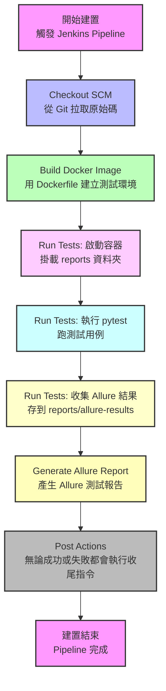

# Jenkins Pipeline Build Flow


```mermaid
flowchart TD
    %% 主流程 + 說明
    A[開始建置<br/>觸發 Jenkins Pipeline] --> 
    B[Checkout SCM<br/>從 Git 拉取原始碼] --> 
    C[Build Docker Image<br/>用 Dockerfile 建立測試環境] --> 
    D1[Run Tests: 啟動容器<br/>掛載 reports 資料夾] --> 
    D2[Run Tests: 執行 pytest<br/>跑測試用例] --> 
    D3[Run Tests: 收集 Allure 結果<br/>存到 reports/allure-results] --> 
    E[Generate Allure Report<br/>產生 Allure 測試報告] --> 
    F[Post Actions<br/>無論成功或失敗都會執行收尾指令] --> 
    G[建置結束<br/>Pipeline 完成]

    %% 顏色設定
    classDef startEnd fill:#f9f,stroke:#333,stroke-width:2px;
    classDef checkout fill:#bbf,stroke:#333,stroke-width:2px;
    classDef build fill:#bfb,stroke:#333,stroke-width:2px;
    classDef test1 fill:#fcf,stroke:#333,stroke-width:2px;
    classDef test2 fill:#cff,stroke:#333,stroke-width:2px;
    classDef test3 fill:#ffc,stroke:#333,stroke-width:2px;
    classDef report fill:#ffb,stroke:#333,stroke-width:2px;
    classDef post fill:#bbb,stroke:#333,stroke-width:2px;

    %% 套用顏色
    class A startEnd;
    class B checkout;
    class C build;
    class D1 test1;
    class D2 test2;
    class D3 test3;
    class E report;
    class F post;
    class G startEnd;
```
# DinD + Jenkins Pipeline 資料流圖


```