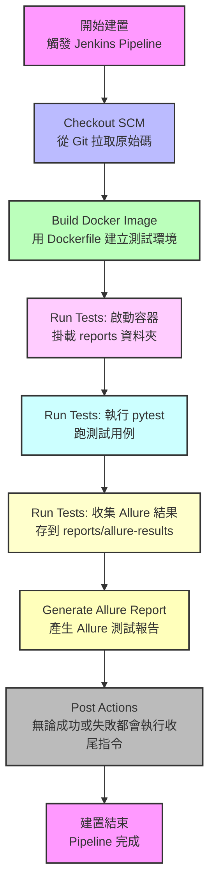
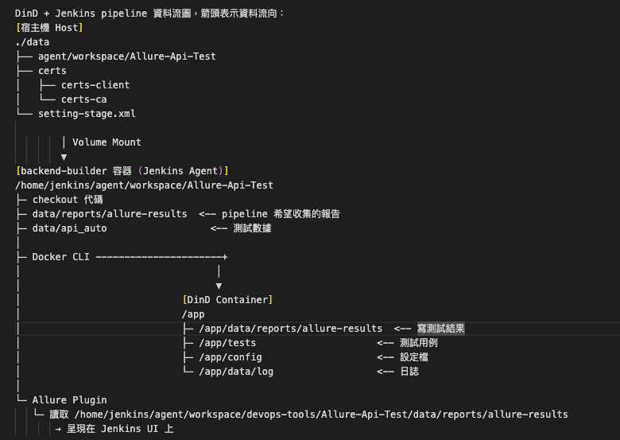

# Jenkins Pipeline Build Flow


# DinD + Jenkins Pipeline 資料流圖


# 项目介绍
## API自动化项目介绍
[API_TestAutomation_README.md](API_TestAutomation_README.md)

## UI自动化项目介绍
[UI_TestAutomation_README.md](UI_TestAutomation_README.md)

# 本地开发

一键拉起整套开发环境（依赖 + 后端 + 异步任务 + 前端热更新）：

```bash
make dev        # 等价于 ./start-dev.sh
```

`make dev` 会依次完成：

1. `docker compose up -d redis postgres` —— 起 Redis + PostgreSQL 依赖（代码连 `127.0.0.1`）
2. `alembic upgrade head` —— 数据库迁移
3. FastAPI（uvicorn）→ http://127.0.0.1:54351 ，带 `--reload` 热更新
4. Celery worker —— 跑用例 / AI 任务 / 设备探活
5. Celery beat —— 定时任务调度（一个集群只能起一个）
6. 前端 Vite dev → http://localhost:5173 （`/api` 自动代理到后端）

**Ctrl+C 一次即可干净停掉所有进程**，日志在 `data/logs/dev/`。

## 常用命令

| 命令 | 作用 |
|---|---|
| `make dev` | 启动本地开发环境 |
| `make stop` | 清理残留进程（终端被关 / 端口被占时用） |
| `make migrate` | `alembic upgrade head` |
| `make lint` | 前端 eslint 检查 |
| `make build` | 前端构建（`tsc -b && vite build`） |

## 按需裁剪（环境变量，无需改脚本）

```bash
START_INFRA=0 ./start-dev.sh                 # 已自己起了 redis/postgres，跳过 docker
START_WEB=0   ./start-dev.sh                 # 只起后端
START_WORKER=0 START_BEAT=0 ./start-dev.sh   # 只起 API + 前端，不跑异步任务
API_RELOAD=0  ./start-dev.sh                 # 关 uvicorn 热重载
RUN_MIGRATIONS=0 ./start-dev.sh              # 跳过 alembic 迁移
```

## 前置准备

首次拉下代码后，先装依赖：

```bash
make setup        # = venv/bin/pip install -r requirements.txt + cd frontend && npm install
```

- 后端：依赖装进 `venv/`（脚本会自动 `source venv/bin/activate`，并用 `python -m` 调用 alembic/uvicorn/celery）。脚本启动前有依赖预检，缺了会提示装；也可 `AUTO_INSTALL=1 ./start-dev.sh` 让它自动装。
- 前端：`make setup` 会跑 `npm install`；没装 `node_modules` 时启动脚本会跳过前端并提示。
- 依赖服务：需要本机有 Docker（起 Redis/Postgres）；若没装，用 `START_INFRA=0` 并自行保证 Redis(6379) / Postgres(5432) 在运行。
- 用别的 Python 环境（非 venv）：`USE_VENV=0 PYTHON=/path/to/python ./start-dev.sh`。

## 停止与排错

```bash
make stop                       # 停 API / worker / beat / 前端（不动 docker 依赖）
STOP_INFRA=1 make stop          # 顺带 docker compose stop redis postgres
```

`stop-dev.sh` 按端口精准杀前端(5173)/后端(54351)、按 `celery_app` 特征杀 worker/beat，默认不动数据服务，避免误删数据。


