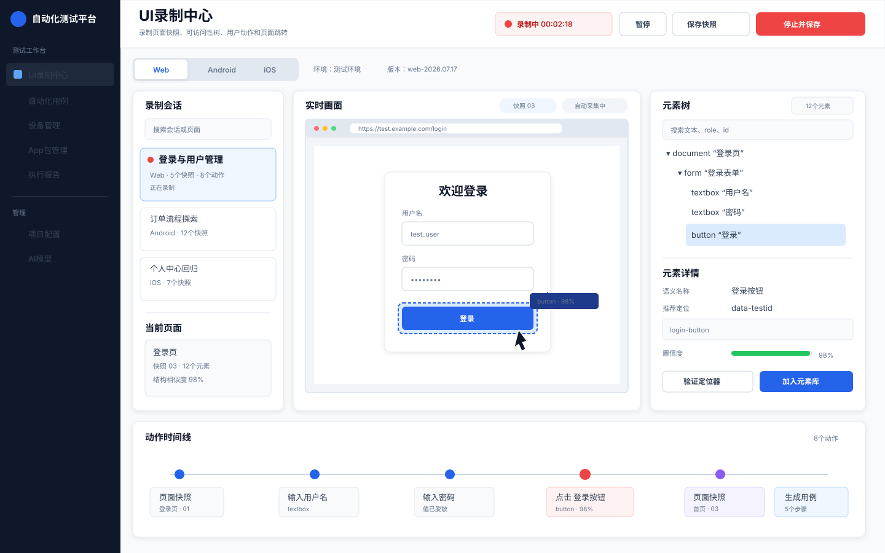

# UI 录制中心需求文档与实施方案

> 文档版本：v1.3  
> 文档状态：已定版（评审问题全部关闭；另有 ADR-11 / ADR-12 两项新增决策待阶段 0 定版，见第 27 节）  
> 编写日期：2026-07-17  
> 修订日期：2026-07-20  
> 适用项目：Automation Test Platform  
> 目标平台：Web / Android / iOS  
> 关联文档：《UI 录制中心-决策记录 ADR》v1.1（本文档所有决策以 ADR 为事实源，见 docs/UI录制中心-决策记录-ADR.md）
>
> v1.1 变更摘要：
> 1. 关闭第 25 节全部 10 项待评审问题，决策沉淀至第 26 节《决策记录摘要》；
> 2. WebView/Hybrid 支持纳入阶段 2/3 正式范围，阶段 2 排期调整为 3～4 周；
> 3. 新增单页面补录机制（FR-01）；
> 4. 明确截图脱敏机制为"元素树坐标驱动遮罩"（10.3）；
> 5. 阶段 0 预研新增：组件库事件捕获验证、WebView 调试可行性验证；
> 6. 明确 macOS 宿主机混合部署架构（11.4），Appium/模拟器不进 Docker；
> 7. 数据保留策略调整为永久保存 + 手动删除 + 删除审计（18）；
> 8. 补充实时画面刷新率预研目标与元素指纹分期说明。
>
> v1.2 变更摘要（对照代码库评审后修订）：
> 1. 新增第 27 节两项待定决策：ADR-11（API↔Recorder 控制通道方案）、ADR-12（Web Recorder 部署位置与有头模式），均要求阶段 0 定版；相应修订第 12.1、15、21 节；
> 2. 第 16.2 补强清单与阶段 2 任务新增"设备租约超时与强制释放"（现有 probe_devices 对 busy 设备不做回收）；
> 3. 第 17 节明确 AI 步骤白名单由 Step Catalog 的 `ai_allowed` 标记定义，显式排除 `web_evaluate`、`sql` / `sql_query` 等任意代码类步骤。
>
> v1.3 变更摘要：
> 1. 新增 FR-16 页面漫游视图：截图热区可点击、沿跳转边导航的"应用镜像"浏览形态；
> 2. 新增 FR-17 步骤编辑器元素选择器：编辑用例步骤时从元素库按页面点选元素、自动填入定位器；
> 3. 明确"人工编辑路线（元素仓库 + 编辑器选元素）先于 AI 组合生成路线交付"（24 节第 9 条），FR-17 与 FR-16 基础版纳入阶段 1；
> 4. 《决策记录 ADR》独立成文（docs/UI录制中心-决策记录-ADR.md，v1.1）。

## 1. 文档目的

本文档定义“UI 录制中心”的产品需求、业务流程、数据模型、技术架构、接口设计、三端采集方案、AI 用例生成衔接方式、验收标准和分阶段实施计划。

UI 录制中心的核心目标不是单纯录制视频，而是在人工操作 Web、Android 或 iOS 应用的过程中，持续采集：

- 页面截图；
- DOM、UI Hierarchy 或 Accessibility Tree；
- 用户点击、输入、滑动、切换等操作；
- 操作前后的页面状态；
- 页面之间的跳转关系；
- 页面元素及其候选定位器；
- 应用版本、设备、环境等可追溯信息。

这些数据共同构成项目级“UI 地图”和“元素事实库”，供 AI 生成可执行的 UI 自动化测试用例，减少人工使用浏览器开发者工具或 Appium Inspector 查找定位器的工作。

## 2. 背景与问题

当前项目已经具备以下基础能力：

- Web：Playwright/Selenium 双适配器及 `web_*` Step Runner；
- Android/iOS：Appium Session、设备池及 `app_*` Step Runner；
- 测试执行：`TestCase → TestStep → StepDispatcher → Runner` 统一 v2 链路；
- 平台能力：设备管理、App 包管理、步骤编辑器、Celery 异步执行、Allure 报告；
- AI 能力：需求上下文、UI 图片、Vision/OCR、AI 草稿、人工审核和批量入库。

但当前 AI 生成 UI 自动化用例存在一个关键事实缺口：AI 可以理解业务意图，却未必知道真实页面有哪些元素，也无法仅凭截图可靠确定 CSS、resource-id、accessibility id 等定位器。

现状导致以下问题：

1. AI 容易生成看似合理、实际不存在的定位器；
2. 测试人员仍需重新打开目标页面查找元素；
3. 页面变化后，旧定位器失效但平台缺少对比依据；
4. Web、Android、iOS 的 UI 结构没有统一沉淀；
5. 执行失败时缺少“历史快照 vs 当前页面”的结构对比；
6. 一次人工探索产生的页面知识无法被后续用例复用。

## 3. 产品目标

### 3.1 核心目标

1. 用户可以从平台启动和停止 Web、Android、iOS UI 录制；
2. 平台自动记录操作、页面快照、元素树和页面跳转；
3. 平台对重复页面自动去重，对同一页面的不同状态进行归类；
4. 平台为元素生成多个候选定位器和稳定性评分；
5. 用户可以浏览、搜索、命名和维护页面及元素；
6. AI 可以从 UI 地图检索真实页面和元素，生成现有 Runner 可执行的 `TestStep`；
7. 执行失败后可以使用录制快照辅助定位器修复；
8. 所有录制数据必须绑定项目、环境和应用版本。

### 3.2 成功指标

第一阶段建议跟踪以下指标：

| 指标 | MVP 目标 |
|---|---:|
| 录制动作识别成功率 | ≥ 95% |
| 页面快照采集成功率 | ≥ 98% |
| 重复快照去重率 | ≥ 80% |
| 高置信度元素定位器可执行率 | ≥ 90% |
| 从录制流程生成用例成功率 | ≥ 95% |
| AI 生成用例首次可运行率 | Web ≥ 80%，App ≥ 70% |
| 敏感输入明文落库数量 | 0 |

### 3.3 非目标

MVP 不包含：

- 自动遍历所有未访问页面的智能爬虫；
- 无人值守探索整个应用；
- 自动修改并直接发布正式测试用例；
- 复杂视觉识别和纯坐标自动化；
- 云真机平台；
- 大规模多租户录制并发；
- 完整替代 Playwright Inspector 或 Appium Inspector 的全部调试能力。

## 4. 名词定义

| 名词 | 定义 |
|---|---|
| 录制会话 | 一次从开始录制到停止保存的完整过程 |
| 页面快照 | 某一时刻的截图、元素树、页面元数据和结构摘要 |
| 页面状态 | 同一逻辑页面在弹窗、错误、加载、空数据等条件下的变体 |
| 元素快照 | 页面快照中的一个可识别 UI 元素 |
| 录制动作 | 用户执行的点击、输入、滑动、等待、返回等操作 |
| UI 地图 | 页面节点、页面状态、元素节点和跳转边组成的关系图 |
| 元素事实库 | 项目中已经通过快照证明存在的页面元素集合 |
| 候选定位器 | 同一元素的多种可执行定位方式及评分 |
| 页面指纹 | 对规范化元素树计算的 Hash 和特征向量 |
| 元素指纹 | 根据语义、属性、树位置和邻近元素生成的稳定标识 |

## 5. 用户角色

### 5.1 测试工程师

- 创建录制会话；
- 选择平台、环境、设备或浏览器；
- 操作应用并检查录制结果；
- 命名页面和元素；
- 从录制结果生成测试用例；
- 审核 AI 推荐的定位器。

### 5.2 产品经理/业务人员

- 浏览录制流程和页面截图；
- 将录制结果关联需求；
- 查看从业务流程生成的测试场景；
- 不直接维护复杂定位器。

### 5.3 自动化测试负责人

- 维护定位器优先级规范；
- 审核低置信度元素；
- 管理版本过期快照；
- 查看录制质量和元素复用率。

### 5.4 系统管理员

- 配置 Playwright/Appium 环境；
- 管理设备和录制并发；
- 配置数据保留和脱敏规则；
- 排查录制 Agent 状态。

## 6. 产品范围与信息架构

UI 录制中心建议包含以下页面：

1. 录制会话列表；
2. 新建录制向导；
3. 录制工作台；
4. 录制结果详情；
5. UI 地图；
6. 页面快照详情；
7. 元素库；
8. 生成用例审核；
9. 版本变更与失效元素；
10. 录制配置。

## 7. 核心用户流程

### 7.1 新建录制

```text
进入 UI 录制中心
→ 点击“新建录制”
→ 选择项目和关联需求
→ 选择 Web / Android / iOS
→ 选择环境、浏览器或设备
→ 填写版本信息和初始入口
→ 完成环境预检
→ 启动录制
```

新建录制的必填项：

| 字段 | Web | Android | iOS |
|---|---|---|---|
| 项目 | 必填 | 必填 | 必填 |
| 录制名称 | 必填 | 必填 | 必填 |
| 环境 | 必填 | 必填 | 必填 |
| 版本/构建号 | 建议 | 必填 | 必填 |
| 初始 URL | 必填 | - | - |
| 浏览器 | 必填 | - | - |
| 设备 | - | 必填 | 必填 |
| App 包 | - | 建议 | 建议 |
| appPackage/appActivity | - | 必填或从包解析 | - |
| bundleId | - | - | 必填 |

### 7.2 录制操作

```text
用户操作目标应用
→ 平台识别动作目标
→ 记录动作前快照
→ 执行动作或监听外部动作
→ 等待页面稳定
→ 记录动作后快照
→ 对快照规范化和去重
→ 创建页面跳转边
→ 继续下一动作
```

### 7.3 停止与整理

```text
停止录制
→ 关闭或保留调试 Session
→ 完成待处理快照解析
→ 展示动作时间线
→ 自动推荐页面名称和元素名称
→ 用户修正、删除噪声动作
→ 保存为 UI 地图
```

### 7.4 生成用例

支持两种入口：

1. 从录制动作直接生成：将时间线转成一条可执行用例；
2. 从需求生成：AI 根据业务场景从多个录制页面中检索并组合新用例。

```text
选择录制流程或需求
→ 选择目标平台
→ AI 检索页面和元素
→ 生成自动化草稿
→ 程序静态校验
→ 人工审核
→ 写入 TestCase + TestStep
→ 运行验证
```

## 8. 功能需求

### FR-01 录制会话管理

- 支持新建、启动、暂停、恢复、停止和取消录制；
- 支持按项目、平台、环境、版本、状态和创建人筛选；
- 录制状态包括：`draft`、`starting`、`recording`、`paused`、`processing`、`completed`、`failed`、`cancelled`；
- 同一个设备同时只允许一个活跃移动端录制会话；
- 同一个 Web 录制 Worker 的并发上限可配置；
- 异常中断的会话可以保留已采集数据并标记失败原因；
- 录制停止后默认关闭 WebDriver/Appium Session；可选择保留短时间用于调试；
- 支持**单页面补录**会话类型（ADR-05）：针对单个逻辑页面发起轻量录制（进入页面 → 采集快照 → 保存），用于 UI 局部变更后更新该页面元素与定位器，无需重录整条业务流程；补录产生的新快照按 FR-07 归入原逻辑页面。

### FR-02 环境预检

开始录制前执行预检：

Web：

- Playwright 包是否安装；
- 对应浏览器内核是否存在；
- 初始 URL 是否可访问；
- 浏览器是否能启动；
- 是否允许弹出有头浏览器。

Android：

- 设备状态是否为 `idle`；
- ADB 是否可见；
- Appium `/status` 是否健康；
- UiAutomator2 Driver 是否可用；
- App 是否已安装或安装包是否可访问。

iOS：

- macOS/Xcode 是否可用；
- Simulator/真机是否可见；
- Appium XCUITest Driver 是否可用；
- WDA 是否可以启动；
- bundleId 和签名配置是否有效。

预检失败必须返回可操作的修复建议，不允许只显示“启动失败”。

### FR-03 实时画面

- Web 显示浏览器页面截图或实时流；
- Android/iOS 显示设备截图，MVP 可采用每 500～1000ms 刷新截图；
- 由于移动端仅支持平台远程画面操作（ADR-02），画面刷新延迟直接影响点击/滑动操作体验；阶段 0 预研需实测刷新周期能否压到 200～300ms，若不能达到，需在产品层面向测试人员管理体验预期（精确坐标类滑动手势可能误触）；
- 支持画面缩放、适配窗口和原始尺寸；
- 鼠标移动到元素时显示边界框；
- 点击画面时定位到元素树对应节点；
- 展示当前页面、快照编号和采集状态；
- 敏感页面允许暂停截图采集。

### FR-04 元素树

- Web 显示 DOM 摘要和 Accessibility Tree；
- Android 显示 UiAutomator2 Page Source；
- iOS 显示 XCUITest Accessibility Tree；
- 支持树节点展开、折叠和搜索；
- 搜索字段包括文本、role/class、id、accessibility name；
- 点击元素树节点时在截图中高亮；
- 展示元素属性、推荐定位器、备用定位器和置信度；
- 支持人工命名元素并加入元素库；
- 支持验证某个定位器当前是否唯一匹配。

### FR-05 动作录制

MVP 支持：

| 动作 | Web | Android | iOS |
|---|---:|---:|---:|
| 打开/导航 | 是 | 启动 App | 启动 App |
| 点击 | 是 | 是 | 是 |
| 输入 | 是 | 是 | 是 |
| 下拉选择 | 是 | 视控件 | 视控件 |
| 滑动 | 页面滚动 | 是 | 是 |
| 等待 | 是 | 是 | 是 |
| 返回 | 浏览器返回 | 系统返回 | 导航返回 |
| 截图 | 是 | 是 | 是 |
| 文本断言标记 | 是 | 是 | 是 |

每个动作必须记录：

- 动作类型；
- 动作时间；
- 来源快照；
- 目标快照；
- 目标元素；
- 原始事件；
- 解析后的平台步骤；
- 输入值或变量引用；
- 执行耗时；
- 采集错误。

### FR-06 页面快照

快照采集时机：

- 录制启动后；
- 页面 URL、Activity、Window 或主要结构发生变化；
- 点击、输入、滑动等动作前后；
- 弹窗、抽屉、Tab 等显著状态变化；
- 用户手动点击“保存快照”；
- AI/规则判断页面稳定后。

快照内容：

- 截图；
- 原始元素树；
- 规范化元素树；
- 页面元数据；
- 页面指纹；
- 元素列表；
- 敏感信息处理结果；
- 来源会话、动作、环境和版本。

### FR-07 快照去重与状态归类

快照处理过程：

1. 删除动态时间戳、随机 ID 和无意义节点；
2. 将输入值替换为变量或脱敏占位符；
3. 对树结构和属性进行稳定排序；
4. 计算精确 Hash；
5. 计算结构相似度；
6. 判断是重复快照、同页面新状态还是新页面。

默认建议阈值：

- Hash 相同：完全重复；
- 结构相似度 ≥ 0.95：同一状态更新；
- 0.75～0.95：同页面不同状态，待规则或人工确认；
- ＜ 0.75：候选新页面。

阈值必须可按平台配置，不应写死在 Runner 中。

### FR-08 元素定位器生成

每个元素保存多个定位器，不只保存一个最终值。

Web 优先级：

```text
data-testid
→ role + accessible name
→ 稳定 id/name
→ 稳定 CSS
→ text
→ XPath
```

Android 优先级：

```text
accessibility_id/content-desc
→ resource-id
→ Android UiAutomator
→ text + class 组合
→ XPath
→ 坐标
```

iOS 优先级：

```text
accessibility_id/name
→ iOS Predicate
→ iOS Class Chain
→ label + type 组合
→ XPath
→ 坐标
```

评分至少考虑：

- 是否唯一匹配；
- 属性是否稳定；
- 是否依赖文本和多语言；
- 是否包含随机数字；
- 是否为绝对 XPath；
- 是否为坐标；
- 是否在多个版本中保持一致；
- 是否符合项目定位器规范。

### FR-09 动作时间线编辑

- 支持查看动作前后截图；
- 支持修改动作名称；
- 支持删除误操作和无效等待；
- 支持插入断言、等待和截图；
- 支持合并连续输入；
- 支持将真实输入值替换成变量；
- 支持拖拽调整顺序，但调整后必须重新校验页面衔接；
- 支持从任意时间点回放；
- 支持一键转换成自动化草稿。

### FR-10 UI 地图

- 页面作为节点，动作和跳转作为边；
- 展示形态（ADR-07）：MVP 采用列表视图 + 跳转关系表格（页面列表、每页入边/出边），不做图形化节点连线地图；图形化 UI 地图后续独立立项、另出需求文档，本文所述"UI 地图"的数据模型与 API 对两种展示形态通用；
- 同一页面的不同状态归属到同一个逻辑页面；
- 支持按平台、版本、模块和需求筛选；
- 支持查看页面入边和出边；
- 支持查找孤立页面和未覆盖路径；
- 支持标记入口页、关键页和敏感页；
- 支持将旧版本页面标记为 `stale` 或 `archived`。

### FR-11 元素库

- 元素应绑定逻辑页面，不只绑定单次快照；
- 保存语义名称、业务含义、候选定位器和版本历史；
- 支持元素别名，如“提交按钮/登录按钮”；
- 支持查看元素被哪些用例引用；
- 页面版本变化后自动检测元素新增、删除和属性变化；
- 低置信度或失效元素进入待处理队列；
- 元素更新不得直接静默修改正式用例。

元素指纹算法分期实施：

- 阶段 1 提供基础版指纹：基于元素 role/class、稳定属性（id、name、accessibility id）、文本语义和父级路径的加权 Hash，权重配置化；
- 跨版本指纹匹配（属性部分变化后的相似元素识别）、页面大改版后的指纹漂移处理，作为阶段 4 的正式任务细化设计，阶段 1 不承诺跨版本匹配准确率；
- 阶段 0 需在契约文档中冻结指纹输入字段清单，避免阶段 4 重构时历史指纹全部失效。

### FR-12 从录制动作生成用例

生成结果必须符合现有 `TestCase + TestStep` 结构：

```json
{
  "name": "用户使用正确账号登录",
  "case_type": "web",
  "variables": {
    "username": "test_user",
    "password": "${login_password}"
  },
  "steps": [
    {
      "step_order": 1,
      "step_name": "打开登录页",
      "step_type": "web_goto",
      "config": {"url": "${base_url}/login"}
    },
    {
      "step_order": 2,
      "step_name": "点击登录",
      "step_type": "web_click",
      "config": {
        "by": "css",
        "locator": "[data-testid='login-button']"
      }
    }
  ]
}
```

草稿应保留 `snapshot_id`、`element_id` 和定位器证据，但在提交到 Runner 配置前剥离非执行字段。

### FR-13 AI 根据需求组合新用例

AI 只能使用已登记的 Step Catalog 和 UI 事实：

- 根据需求和功能用例检索相关页面；
- 根据业务动作检索语义相符的元素；
- 选择评分最高的定位器；
- 没有真实元素证据时标记 `needs_ui_detail=true`；
- 不允许凭截图臆造 id、CSS 或 accessibility id；
- 自动化草稿必须通过后端静态校验；
- 至少包含一个有效断言；
- 密码和 Token 只能使用变量引用。

### FR-14 定位器失效分析

执行失败后保存当前页面快照，并与录制快照比较：

```text
主定位器失败
→ 查询 element_id 的备用定位器
→ 在当前页面验证候选定位器
→ 全部失败则比较元素指纹
→ 生成修复建议
→ 用户确认
→ 更新正式用例
```

MVP 只生成建议，不自动修改正式用例。

### FR-15 权限与审计

- 用户必须拥有项目访问权；
- 录制会话、快照、元素和生成用例均继承项目权限；
- 删除录制数据需要审计；
- 元素定位器变更需要记录修改人、修改前后内容和原因；
- AI 生成和修复必须记录模型、Prompt 版本、Token 和来源证据。

### FR-16 页面漫游视图（v1.3 新增）

以"可点击的应用镜像"形态浏览 UI 地图——面向"快速找元素、看页面长什么样"的高频场景，
是 ADR-07 列表视图之外的第三种展示形态（复用同一套数据模型，不涉及图形化节点图）：

- 打开项目的漫游视图，默认显示入口页（或用户标记的关键页）的代表快照截图；
- 截图上按 `ui_element_occurrences.bounds` 叠加透明热区，鼠标悬停高亮元素并显示
  语义名称与最高分定位器；
- 点击一个存在出边（`ui_page_transitions`）的元素 → 视图切换到目标页面的代表快照，
  模拟真实应用的页面跳转；无出边的元素点击时仅展示元素详情；
- 支持面包屑/历史回退、按页面名搜索直达、切换同一逻辑页面的不同状态快照；
- 任意元素支持右键（或操作菜单）：复制定位器 / 查看候选定位器与评分 / 查看被哪些用例引用 /
  插入到用例步骤（联动 FR-17）；
- 页面为 `stale` / `archived` 状态时显著标记，避免按过期页面写用例；
- 阶段 1 交付基础版（截图 + 热区 + 跳转导航 + 复制定位器）；状态切换、引用查询等
  完整体验在阶段 4 增强。

### FR-17 步骤编辑器元素选择器（v1.3 新增）

打通"元素事实库 → 人工编辑用例"的消费闭环——不依赖 AI、不依赖动作录制时间线，
是元素仓库最直接的价值出口：

- 在现有步骤编辑器中编辑 `web_click` / `web_input` / `app_tap` / `app_input` 等
  需要定位器的步骤时，提供"从元素库选择"入口；
- 入口打开元素选择面板：按逻辑页面分组浏览（可复用 FR-16 漫游视图选点），支持按
  语义名称 / 别名 / 定位器内容搜索；
- 选中元素后自动填入该平台评分最高的定位器（by + locator），并在步骤上保留
  `element_id` 引用（执行配置提交时剥离，与 FR-12 草稿一致）；
- 保留 element_id 引用的步骤，在元素失效/更新时可被 FR-14 的失效分析定位到；
- 用户仍可手动改写定位器文本（手写的不带 element_id，不受 ADR-05 约束——该约束
  只管"元素库内定位器"的维护方式，不禁止用例里手写定位器）；
- 阶段 1 交付（依赖：元素库有数据，即快照采集与元素抽取先行）。

## 9. UI 原型



### 9.1 录制工作台布局

- 顶部：平台、环境、版本、录制状态和控制按钮；
- 左侧：录制会话和当前页面摘要；
- 中间：浏览器/设备实时画面及元素高亮；
- 右侧：元素树、元素属性和定位器候选；
- 底部：动作时间线、快照节点和生成用例入口。

### 9.2 关键交互

1. 点击实时画面元素，同时选中右侧元素树节点；
2. 点击元素树节点，在实时画面显示边界框；
3. 点击时间线动作，显示动作前后快照；
4. 定位器验证成功后可以加入元素库；
5. 停止录制后，可以清理时间线并生成用例；
6. 录制中离开页面时弹出二次确认。

## 10. 非功能需求

### 10.1 性能

- 单次快照采集目标耗时：Web ≤ 1s，移动端 ≤ 3s；
- 录制操作不得因快照解析阻塞超过 500ms；
- 原始树解析、去重和元素抽取应进入异步处理队列；
- UI 工作台加载最近 100 个动作时目标 ≤ 2s；
- 大型 DOM/XML 必须限制大小并支持截断提示。

### 10.2 稳定性

- Driver 断开后会话必须进入失败或可恢复状态；
- 无论任务如何结束，都必须释放浏览器、Appium Session 和设备锁；
- Celery Worker 异常不得导致设备长期停留在 `busy`；
- 快照写入采用临时文件后原子重命名；
- 重复处理同一个快照任务应保持幂等。

### 10.3 安全

- 密码输入不记录真实值；
- Cookie、Authorization、Token 和 Session Storage 默认脱敏；
- DOM/XML 中命中敏感字段规则的值替换为占位符；
- 截图支持敏感区域遮罩。遮罩机制明确为：**先在元素树中按规则识别敏感元素（如 `type=password` 的 input、命中敏感字段名规则的控件），取其 bounds 坐标，再对截图中对应像素区域打码**；不采用图像内容识别方案，不引入视觉检测模型；元素树无法提供 bounds 时允许对该快照整图标记"含未定位敏感区域"并提示人工处理；
- Appium 服务不得直接暴露到无鉴权网络；
- 不允许 AI 生成并执行任意 Python、Shell 或 JavaScript；
- 录制产物遵循项目数据保留期限。

### 10.4 可观测性

记录以下指标：

- 活跃录制会话数；
- 快照采集耗时；
- 快照解析失败数；
- 去重命中率；
- 每个平台元素数量；
- 定位器唯一匹配率；
- Driver/Appium 断开次数；
- 录制生成用例的采纳率；
- 页面版本失效元素数量。

## 11. 技术架构

### 11.1 总体架构

```text
React 录制工作台
        │ REST + WebSocket/SSE
        ▼
FastAPI Recording API
        │
        ├── Recording Orchestrator
        │      ├── Web Recorder (Playwright)
        │      ├── Android Recorder (Appium/UiAutomator2)
        │      └── iOS Recorder (Appium/XCUITest)
        │
        ├── Snapshot Processor
        │      ├── 脱敏与规范化
        │      ├── 页面/元素指纹
        │      ├── 去重与状态归类
        │      └── 定位器候选生成
        │
        ├── UI Map Service
        ├── Element Repository
        └── AI Automation Draft Service
                │
                ▼
TestCase + TestStep
        │
        ▼
现有 v2 StepDispatcher / Runner
```

### 11.2 模块边界

建议新增：

```text
server/api/ui_recordings.py
server/api/ui_snapshots.py
server/api/ui_elements.py
server/services/ui_recording_service.py
server/services/ui_snapshot_service.py
server/services/ui_map_service.py
server/services/ui_locator_service.py
server/services/ui_case_generation_service.py
tasks/ui_recording_task.py
tasks/ui_snapshot_task.py
runners/recording/web_recorder.py
runners/recording/app_recorder.py
runners/recording/protocol.py
frontend/src/pages/ui-recording/
```

录制模块可以调用 Playwright/Appium，但不得成为新的测试执行入口。正式测试仍通过现有 v2 链路执行。

### 11.3 录制器协议

Web 和 App 录制器实现同一个协议：

```python
class UIRecorder(Protocol):
    def start(self, config: dict) -> None: ...
    def pause(self) -> None: ...
    def resume(self) -> None: ...
    def capture_snapshot(self, reason: str) -> dict: ...
    def perform_action(self, action: dict) -> dict: ...
    def stop(self) -> None: ...
```

录制器返回纯字典，不依赖 ORM；持久化由服务层和任务层负责，与现有 Runner 的模块约束保持一致。

### 11.4 部署架构（ADR-10）

开发与 CI 环境为 macOS 宿主机（MacBook），采用**混合部署模式**：

```text
macOS 宿主机（原生运行，不进 Docker）
├── Android Emulator（Android Studio 管理，Apple Silicon 使用 ARM 镜像）
├── iOS Simulator（Xcode 管理）
└── Appium Server（npm 安装，监听 4723，连接上述模拟器）

Docker Compose（仅运行）
├── FastAPI 后端
├── PostgreSQL
├── Redis + Celery Worker
└── 前端
```

硬性约束与理由：

1. iOS Simulator 依赖 Xcode 与 macOS 系统框架，无法运行于 Docker 容器，无变通方案；
2. macOS 上的 Docker 运行在虚拟机中，无嵌套虚拟化能力，Android Emulator 在其中无硬件加速、性能不可用；
3. **禁止将 Appium 或模拟器写入 docker-compose**；
4. 容器内服务通过 `host.docker.internal:4723` 访问宿主机 Appium；
5. 提供统一启动脚本拉起宿主机侧服务（模拟器 + Appium），部署文档必须说明混合结构。

### 11.5 存储抽象（ADR-03）

快照文件（截图、原始树、规范化树）MVP 存储于本地共享 Volume，但必须满足：

- 文件存取统一封装为 `StorageService` 接口（`save_file` / `get_file` / `delete_file` / `exists` 等）；
- 业务代码不得直接拼接文件路径读写磁盘；
- 后续切换 MinIO/OSS 时仅替换该接口实现，不改动业务层。

## 12. 三端采集方案

### 12.1 Web

第一版采用 Playwright 有头模式：

- 使用独立 Browser Context；
- 采集 `page.content()`；
- 采集 ARIA Snapshot；
- 采集页面截图；
- 监听 `framenavigated`、popup、dialog 和 URL 变化；
- 注入事件监听器捕获 click/input/change；
- 对跨域 iframe 标记受限范围；
- 对 Shadow DOM 尽量展开并保留宿主路径；
- 操作后等待 DOM 短暂稳定，但不无限等待 network idle。

浏览器方案已定版（ADR-01）：仅支持平台通过 Playwright 启动的受控浏览器，默认 Chromium，向导中可选 Chromium/Firefox/WebKit（Playwright 多内核适配成本低）。连接用户已有 Chrome（浏览器扩展或 CDP 接入）明确排除出 MVP，作为远期能力另立需求。

有头模式的运行位置存在硬约束（ADR-12 待定，阶段 0 必须定版）：现有 `runners/web/adapters.py` 中 PlaywrightAdapter 在无 `DISPLAY` 环境下会强制降级为 headless，而按 11.4 部署架构 Celery Worker 运行在 Docker 容器内（无 DISPLAY）——"用户直接操作弹出的有头浏览器窗口"在容器内不成立。候选方案：① Web Recorder 与 Appium 同侧，在 macOS 宿主机原生运行（推荐，与本地化部署背景一致）；② 容器内 headless + 远程画面转发，Web 端操作也走 ADR-02 式平台画面转发。方案选择直接影响事件捕获方式（注入监听器 vs 平台转发）与阶段 1 排期，详见第 27 节 ADR-12。

事件捕获兼容性风险（阶段 0 必验）：现代前端框架（React/Vue）普遍使用合成事件与事件委托，原生注入监听器捕获的 target 可能与框架内部触发组件不一致，尤其是组件库封装控件（下拉选择、日期选择器、级联选择等）。阶段 0 预研必须对主流组件库（Ant Design、Element Plus、MUI 至少一种，优先被测系统实际使用的组件库）的关键控件实测事件捕获准确率，输出兼容性结论与降级策略（无法关联元素时回退为坐标动作 + 人工标注）。

### 12.2 Android

- 使用现有设备池锁定设备；
- 通过 Appium UiAutomator2 建立 Session；
- 使用 `driver.page_source` 获取 XML；
- 使用截图接口获取 PNG；
- 操作优先从平台画面触发，以便准确关联元素；
- 保存 `appPackage`、`appActivity`、orientation 和 window size；
- 操作后轮询结构 Hash，稳定后生成目标快照；
- 设备锁必须在 `finally` 中释放。

用户直接触摸真机的监听能力不作为 MVP（ADR-02）：平台可能识别页面变化，但无法稳定知道用户点击了哪个元素。第一版移动端录制仅支持平台远程画面操作。

WebView / Hybrid 支持（ADR-08，阶段 2 正式范围）：

- 检测当前页面 Context 列表，识别 `WEBVIEW_*` Context 并切换采集；
- WebView 内部采集 DOM（复用 Web 侧规范化与定位器生成逻辑），Native 层采集 XML，产出混合元素树，节点标记所属 Context；
- 硬性前提：被测 App 的 WebView 必须开启 `setWebContentsDebuggingEnabled(true)`（debug 包通常默认开启，release 包默认关闭），否则无法获取 WebView 内部 DOM；需提前与被测应用开发方确认可提供带调试开关的测试包，此项为阶段 0 预研必验项；
- 在 WebView 能力交付前的中间版本，遇到 WebView 页面必须明确标记"WebView 区域，暂不支持元素采集"，不得静默出错。

### 12.3 iOS

- Recorder 必须运行在 macOS + Xcode 节点；
- 使用 Appium XCUITest；
- 先支持 Simulator，再支持真机；
- 获取 Accessibility Tree、截图、bundleId、orientation 和 window size；
- 真机支持 WDA 端口隔离和签名配置；
- 对系统权限弹窗、键盘和 WebView Context 单独标记；
- WebView / Hybrid 支持（ADR-08，阶段 3 正式范围）：通过 XCUITest + WKWebView Context 切换采集内部 DOM，方案与 Android 侧对齐（混合元素树、Context 标记、交付前兜底标记）；iOS 侧 WebView 调试依赖 Safari Remote Debugging 能力，Simulator 默认可用，真机需开启 Web 检查器；
- iOS 节点不部署到 Linux Worker（本项目开发环境宿主机即 macOS，见 11.4）。

## 13. 数据模型

建议新增以下 PostgreSQL 表。

### 13.1 ui_recording_sessions

| 字段 | 类型 | 说明 |
|---|---|---|
| id | bigint | 主键 |
| project_id | bigint | 项目 |
| requirement_id | bigint nullable | 关联需求 |
| environment_id | bigint nullable | 环境 |
| name | varchar(200) | 会话名称 |
| platform | varchar(20) | web/android/ios |
| status | varchar(20) | 会话状态 |
| app_version | varchar(100) | 版本/构建号 |
| entry_config | JSONB | URL、bundleId 等入口配置 |
| device_id | bigint nullable | 移动设备 |
| owner_user_id | bigint | 创建人 |
| agent_id | varchar(100) nullable | 执行节点 |
| started_at | timestamp | 开始时间 |
| ended_at | timestamp nullable | 结束时间 |
| error_message | text nullable | 失败原因 |
| stats | JSONB | 快照、动作和元素统计 |

### 13.2 ui_pages

逻辑页面，不等于单次快照。

| 字段 | 类型 | 说明 |
|---|---|---|
| id | bigint | 主键 |
| project_id | bigint | 项目 |
| platform | varchar(20) | 平台 |
| name | varchar(200) | 页面名称 |
| route_key | varchar(500) nullable | URL/Activity/页面标识 |
| module_id | bigint nullable | 所属模块 |
| status | varchar(20) | current/stale/archived |
| aliases | JSONB | 页面别名 |
| metadata | JSONB | 扩展属性 |

### 13.3 ui_snapshots

| 字段 | 类型 | 说明 |
|---|---|---|
| id | bigint | 主键 |
| session_id | bigint | 录制会话 |
| page_id | bigint nullable | 逻辑页面 |
| state_name | varchar(200) nullable | 页面状态 |
| sequence_no | integer | 会话内序号 |
| trigger_reason | varchar(50) | 采集原因 |
| screenshot_path | text | 截图路径 |
| raw_tree_path | text | 原始树路径 |
| normalized_tree_path | text | 规范化树路径 |
| exact_hash | varchar(64) | 精确指纹 |
| structure_hash | varchar(64) | 结构指纹 |
| route_info | JSONB | URL/Activity/bundleId |
| viewport | JSONB | 视口或屏幕尺寸 |
| similarity_score | float nullable | 与归属页面相似度 |
| sensitive_mask | JSONB | 脱敏记录 |
| captured_at | timestamp | 采集时间 |

### 13.4 ui_elements

| 字段 | 类型 | 说明 |
|---|---|---|
| id | bigint | 主键 |
| page_id | bigint | 逻辑页面 |
| canonical_name | varchar(200) | 语义名称 |
| element_type | varchar(100) | role/class/type |
| fingerprint | varchar(64) | 元素指纹 |
| aliases | JSONB | 别名 |
| status | varchar(20) | active/unstable/stale |
| first_seen_version | varchar(100) | 首次版本 |
| last_seen_version | varchar(100) | 最近版本 |
| metadata | JSONB | 业务属性 |

### 13.5 ui_element_occurrences

记录某元素在具体快照中的出现。

| 字段 | 类型 | 说明 |
|---|---|---|
| id | bigint | 主键 |
| element_id | bigint | 逻辑元素 |
| snapshot_id | bigint | 快照 |
| tree_path | text | 树路径 |
| bounds | JSONB | 坐标范围 |
| attributes | JSONB | 当前属性 |
| visible | boolean | 是否可见 |
| enabled | boolean | 是否可用 |

### 13.6 ui_element_locators

| 字段 | 类型 | 说明 |
|---|---|---|
| id | bigint | 主键 |
| element_id | bigint | 元素 |
| platform | varchar(20) | 平台 |
| by | varchar(50) | 定位方式 |
| locator | text | 定位表达式 |
| score | float | 评分 |
| unique_match | boolean | 是否唯一 |
| source | varchar(30) | rule/ai/manual |
| validated_at | timestamp nullable | 最近验证时间 |
| status | varchar(20) | active/failed/stale |

### 13.7 ui_recorded_actions

| 字段 | 类型 | 说明 |
|---|---|---|
| id | bigint | 主键 |
| session_id | bigint | 会话 |
| sequence_no | integer | 顺序 |
| action_type | varchar(50) | 动作类型 |
| source_snapshot_id | bigint nullable | 动作前快照 |
| target_snapshot_id | bigint nullable | 动作后快照 |
| element_id | bigint nullable | 目标元素 |
| raw_event | JSONB | 原始事件 |
| normalized_step | JSONB | 映射后的 TestStep 草稿 |
| input_value_masked | text nullable | 脱敏输入 |
| duration_ms | integer nullable | 耗时 |
| status | varchar(20) | 状态 |

### 13.8 ui_page_transitions

| 字段 | 类型 | 说明 |
|---|---|---|
| id | bigint | 主键 |
| project_id | bigint | 项目 |
| source_page_id | bigint | 来源页 |
| target_page_id | bigint | 目标页 |
| action_id | bigint nullable | 触发动作 |
| element_id | bigint nullable | 触发元素 |
| occurrence_count | integer | 出现次数 |

## 14. API 设计

### 14.1 会话接口

```http
POST   /api/ui-recordings
GET    /api/ui-recordings
GET    /api/ui-recordings/{id}
POST   /api/ui-recordings/{id}/start
POST   /api/ui-recordings/{id}/pause
POST   /api/ui-recordings/{id}/resume
POST   /api/ui-recordings/{id}/snapshot
POST   /api/ui-recordings/{id}/stop
POST   /api/ui-recordings/{id}/cancel
DELETE /api/ui-recordings/{id}
```

### 14.2 实时通信

建议使用 WebSocket：

```http
WS /api/ui-recordings/{id}/stream
```

消息类型：

```text
session_status
screen_frame
snapshot_created
action_created
element_selected
tree_updated
processing_progress
error
```

如果第一阶段不希望引入 WebSocket，可以先用短轮询状态 + 定时截图接口，但交互体验较弱。

### 14.3 快照与元素

```http
GET  /api/ui-recordings/{id}/snapshots
GET  /api/ui-snapshots/{id}
GET  /api/ui-snapshots/{id}/tree
GET  /api/ui-snapshots/{id}/screenshot
POST /api/ui-snapshots/{id}/assign-page
GET  /api/ui-pages
GET  /api/ui-pages/{id}
GET  /api/ui-pages/{id}/elements
PUT  /api/ui-elements/{id}
POST /api/ui-elements/{id}/validate-locators
POST /api/ui-elements/{id}/locators
```

### 14.4 动作与生成用例

```http
GET    /api/ui-recordings/{id}/actions
PUT    /api/ui-recorded-actions/{id}
DELETE /api/ui-recorded-actions/{id}
POST   /api/ui-recordings/{id}/generate-case-draft
POST   /api/ai/ui-case-generation
POST   /api/ai/ui-case-drafts/commit
```

## 15. 异步任务设计

建议任务：

```text
start_ui_recording_task(ai_run_id 或 recording_session_id)
process_ui_snapshot_task(snapshot_id)
finalize_ui_recording_task(session_id)
generate_ui_case_task(ai_run_id)
compare_ui_version_task(project_id, platform, version)
```

遵循项目现有 AI 任务不变量：AI 任务 API 层先创建 `AiRun`，Celery 参数只传 `ai_run_id`。

录制长连接不适合完全寄托在普通短任务中，且存在一个必须先解决的寻址问题（ADR-11 待定，阶段 0 必须定版）：REST 的 `start / pause / snapshot / perform_action` 等交互式控制请求打到 FastAPI 进程，而 Playwright/Appium 的 Session 对象存活在另一个进程中；Celery 无法把任务定向路由到"持有该 Session 的那个 Worker 进程"，因此"专用 Worker 管理录制 Session"的方案在没有可寻址机制之前不可行。候选方案：① 独立 Recorder Agent 进程——每个录制节点运行一个小型 HTTP/WS 服务（模式同 Appium Server），API 层按 `agent_id` 转发控制命令（推荐，应作为阶段 1 的一部分而非中期引入）；② Worker 侧持 Session 的线程消费 Redis 命令队列，API 层写命令、订阅结果。无论选哪种，实时画面帧从录制进程回传到前端（经 API 层 WebSocket）都需要跨进程通道（如 Redis pub/sub），需与控制通道一并设计。详见第 27 节 ADR-11。

## 16. 与现有项目的集成点

### 16.1 复用能力

- 复用 `DevicePool` 锁定和释放移动设备；
- 复用 Appium URL、Capabilities 和 Session 构造；
- 复用 Playwright Adapter 的启动配置；
- 复用 App 包管理；
- 复用 `AiRun` 异步任务状态；
- 复用 AI 模型和 Vision/OCR 能力；
- 复用现有步骤编辑器；
- 复用 `TestCase + TestStep` 入库结构；
- 复用 v2 Runner 和 Allure 报告。

### 16.2 需要补强

1. 建立后端统一 Step Catalog，消除前端和后端步骤定义分散；
2. AI 草稿增加 `case_type` 和 `automation_steps`；
3. `batch_commit()` 支持事务性写入自动化 `TestCase + TestStep`；
4. 增加 UI 快照和元素事实库；
5. 增加 WebSocket 或实时帧传输；
6. 增加失败时的页面快照和结构对比；
7. iOS Recorder 独立部署到 macOS 节点；
8. 增加设备租约超时与强制释放：现有 `tasks/probe_devices.py` 对 busy 设备探测失败只累计 failures、不做回收，平台没有租约超时机制；测试执行是分钟级、录制会话是 30 分钟级，Worker 崩溃导致设备卡死 busy 的概率显著放大，必须补租约（lease）+ 超时强制释放 + 释放审计，并作为阶段 2 移动端录制的前置任务。

## 17. AI 生成约束

提供给 AI 的上下文：

- 需求和功能用例；
- 目标平台；
- Step Catalog；
- UI 页面摘要；
- 相关页面的元素列表；
- 页面跳转关系；
- 定位器候选及评分；
- 当前环境变量；
- 已有自动化用例；
- 项目拒绝样例和定位器规范。

硬约束：

1. 只能输出白名单 `step_type`；白名单由 Step Catalog 中每个 step_type 的 `ai_allowed` 标记定义（阶段 0 建立 Step Catalog 时一并确定），以下现存步骤必须显式标记 `ai_allowed=false`：`web_evaluate`（执行任意 JavaScript）、`sql` / `sql_query`（执行任意 SQL）、`app_install` / `app_uninstall`（设备级变更）；
2. 不允许任意代码；
3. 定位器必须引用真实 `element_id` 或标记待补充；
4. Android/iOS 定位方式不得混用；
5. 至少一个断言；
6. 密码、Token 等必须使用变量；
7. 自动化草稿必须通过后端 Schema 和语义校验；
8. AI 输出的 `snapshot_id` 和 `element_id` 必须验证归属当前项目。

## 18. 数据保留与清理

定版策略（ADR-04）：

- 去重后的唯一页面快照及关联数据**永久保存**，系统不做自动过期清理；
- 仅允许用户手动删除；删除必须记录审计日志（删除人、时间、对象、级联范围），删除不可恢复；
- 实时画面的连续帧（500ms～1s 一张的截图流）不属于保存范围，仅用于录制时实时显示，会话结束即丢弃；
- 原始树可压缩保存；
- 重复快照只保留引用计数；
- 删除项目前必须级联清理或归档录制数据；
- 背景假设：项目为小规模本地化部署，一个项目全量录制一次、随被测应用 UI 变更增量补录（ADR-05），总量可控。

## 19. 测试方案

### 19.1 单元测试

- DOM/XML 规范化；
- 页面 Hash；
- 相似度分类；
- 元素指纹；
- 候选定位器评分；
- 敏感信息脱敏；
- 动作到 TestStep 的映射；
- 自动化草稿校验。

### 19.2 集成测试

Web：

- 启动真实 Chromium；
- 录制登录操作；
- 验证截图、ARIA、DOM、动作和跳转；
- 从录制生成用例并执行。

Android：

- 使用一台固定模拟器；
- 建立 Appium Session；
- 录制点击、输入、滑动；
- 验证设备释放；
- 生成用例并回放。

iOS：

- 使用固定 Simulator；
- 建立 XCUITest Session；
- 采集 Accessibility Tree；
- 生成用例并回放。

### 19.3 稳定性测试

- 连续录制 30 分钟；
- 连续采集 500 个动作；
- Worker 重启；
- 浏览器崩溃；
- Appium 断连；
- 设备离线；
- 大型 DOM/XML；
- 高频动画和倒计时页面；
- 多窗口、弹窗和 WebView。

## 20. MVP 验收标准

### 20.1 Web MVP

1. 用户可以创建 Web 录制会话；
2. 平台可以启动 Playwright Chromium 有头浏览器；
3. 用户完成登录流程时，平台记录打开、输入、点击等动作；
4. 每个关键页面保存截图、DOM 和 ARIA Snapshot；
5. 重复登录页不会无限创建重复快照；
6. 页面元素显示至少一个可验证定位器；
7. 密码不以明文保存；
8. 可以从动作时间线生成 `case_type=web` 的草稿；
9. 审核后写入 `TestCase + TestStep`；
10. 生成用例可通过现有 v2 Runner 回放并产出报告。

### 20.2 Android MVP

1. 可以选择一台 `idle` Android 设备；
2. 录制期间设备处于 `busy`；
3. 可以采集截图和 Page Source；
4. 可以记录点击、输入和滑动；
5. 可以提取 resource-id/accessibility id；
6. 可以生成并回放 Android 用例；
7. 正常或异常结束均释放设备。

### 20.3 iOS MVP

1. macOS 节点可以连接一台 Simulator；
2. 可以采集截图和 Accessibility Tree；
3. 可以记录点击和输入；
4. 可以生成 accessibility id/Predicate/Class Chain 候选；
5. 可以生成并回放 iOS 用例；
6. Session 异常结束能够清理 WDA/Appium 资源。

## 21. 实施计划

### 阶段 0：技术预研与契约统一，建议 3～5 个工作日

- 建立 Step Catalog（含每个 step_type 的 `ai_allowed` 标记，见第 17 节）；
- 明确页面、元素、快照和动作协议（含元素指纹输入字段清单冻结，见 FR-11）；
- **定版 ADR-11：API↔Recorder 控制通道方案**（Recorder Agent vs Redis 命令队列，见第 15 节与第 27 节）；
- **定版 ADR-12：Web Recorder 部署位置与有头模式**（宿主机原生 vs 容器内 headless + 画面转发，见 12.1 与第 27 节）；
- 验证 Playwright 事件监听；
- **验证主流组件库（antd/element-plus/MUI，优先被测系统实际使用者）关键控件的事件捕获准确率**，输出兼容性结论与降级策略（见 12.1）；
- 验证 Android/iOS Page Source 性能；
- **验证目标 App 的 WebView 调试可行性**：确认可获得开启 `setWebContentsDebuggingEnabled(true)` 的测试包，实测 Appium Context 切换与 WebView DOM 采集（见 12.2）；
- **实测移动端截图刷新周期能否达到 200～300ms**（见 FR-03）；
- 确定实时通信方案；
- 输出数据库迁移评审稿。

交付物：技术 Spike、数据字典、接口契约、风险结论。

### 阶段 1：Web 录制 MVP，建议 2～3 周

- 会话管理和环境预检；
- Playwright Recorder；
- 截图、DOM、ARIA 采集；
- 动作时间线；
- 快照规范化与去重；
- 元素树和定位器候选；
- Web 录制工作台；
- **页面漫游视图基础版（FR-16：截图 + 热区 + 跳转导航 + 复制定位器）**；
- **步骤编辑器元素选择器（FR-17）**；
- 从录制生成用例并回放。

交付物：可演示的 Web 完整闭环（含"录制 → 元素入库 → 编辑器选元素写用例"的人工编辑闭环）。

### 阶段 2：Android 录制，建议 3～4 周（ADR-08 排期调整）

- **设备租约超时与强制释放（前置任务，见 16.2 第 8 条）**；
- 复用设备池；
- Appium Recorder；
- 远程截图操作；
- XML 元素树；
- Android 定位器生成；
- **WebView Context 切换与 WebView 内 DOM 采集（独立任务卡）**；
- **混合元素树（Native + WebView）处理（独立任务卡）**；
- APK/版本绑定；
- 生成并回放 Android 用例。

交付物：一台模拟器上的 Android 完整闭环（含 WebView 页面采集）。

### 阶段 3：iOS 录制，建议 2～3 周

- macOS Recorder 节点；
- XCUITest Session；
- Simulator 实时画面；
- Accessibility Tree；
- iOS 定位器生成；
- **WKWebView Context 切换与 WebView 内 DOM 采集（独立任务卡）**；
- 生成并回放 iOS 用例。

交付物：一台 Simulator 上的 iOS 完整闭环（含 WebView 页面采集）。

### 阶段 4：AI 组合生成与变更分析，建议 2 周

- 从需求检索 UI 地图；
- AI 自动组合新用例；
- 自动化草稿审核；
- 新旧版本页面比较；
- 定位器修复建议；
- 采纳率和首次运行成功率看板。

## 22. 建议的开发任务拆分

### Backend

- UI Recording ORM、Schema 和 Alembic；
- Recording REST API；
- WebSocket/SSE 通道；
- Recording Orchestrator；
- Snapshot Processor；
- Locator Generator；
- UI Map Service；
- AI Automation Draft；
- 自动化草稿 Commit；
- 数据清理任务；
- 权限和审计。

### Frontend

- 录制会话列表；
- 新建录制向导；
- 录制工作台；
- 实时画面与元素高亮；
- 元素树；
- 动作时间线；
- 页面快照详情；
- UI 地图；
- 元素库；
- 自动化草稿审核。

### Infrastructure

- Web Recorder Worker；
- Android Appium 节点；
- iOS macOS 节点；
- 录制文件存储；
- 节点健康检查；
- 监控和告警。

## 23. 关键风险与应对

| 风险 | 影响 | 应对方案 |
|---|---|---|
| 页面动态内容导致大量重复快照 | 存储膨胀 | 规范化、Hash、相似度和采样限流 |
| 仅凭截图生成错误定位器 | 用例不可执行 | 定位器必须来自元素树证据 |
| Appium Page Source 较慢 | 操作卡顿 | 异步采集、按需采集、稳定后采集 |
| iOS 真机签名复杂 | 交付延期 | 先 Simulator，真机单独阶段 |
| 用户直接操作真机难捕获目标 | 动作无法关联元素 | MVP 采用平台远程操作 |
| Worker 崩溃导致设备 busy | 阻塞后续任务 | 心跳、租约超时和强制释放 |
| 密码等敏感信息进入快照 | 安全事故 | 输入级、树级、截图级三层脱敏 |
| 页面版本变化 | 元素失效 | 版本绑定、元素历史和差异检测 |
| DOM/XML 文件过大 | DB 和接口变慢 | 文件存储、压缩、摘要索引 |
| AI 修改错误定位器 | 回归风险 | 只建议不自动落正式用例 |
| 被测 App WebView 未开调试开关 | WebView DOM 无法采集，ADR-08 目标落空 | 阶段 0 提前与开发方确认测试包；交付前版本对 WebView 页面明确标记不支持 |
| 组件库合成事件与原生监听不一致 | 动作无法关联到正确元素 | 阶段 0 实测组件库兼容性；降级为坐标动作 + 人工标注 |

## 24. 产品决策建议

1. UI 录制中心应先于“AI 自动生成可执行 UI 用例”建设；
2. 第一版必须优先 Web，先验证快照、元素库和生成用例的公共闭环；
3. 移动端 MVP 应要求用户通过平台远程画面操作，不承诺准确监听真机外部触摸（已定版：ADR-02）；
4. 所有定位器必须保存真实元素证据和备用方案；定位器不允许手工修改，仅可通过重录/单页补录更新（已定版：ADR-05）；
5. 页面快照不是视频帧，必须做结构去重和页面状态归类；
6. AI 输出始终经过白名单和 Schema 校验；AI 生成用例必须先关联一条 functional 用例（已定版：ADR-06）；
7. 正式执行继续使用现有 v2 Runner，不增加新 Runner 入口；
8. iOS 必须作为 macOS 节点能力建设，不能放入 Linux Appium 容器中实施（已定版：ADR-10，开发环境宿主机即 macOS，采用 11.4 混合部署架构）；
9. **人工编辑路线先于 AI 生成路线交付**（v1.3）：元素仓库的第一价值出口是"步骤编辑器选元素 + 页面漫游找元素"（FR-16 / FR-17），它不依赖 AI、见效最快；AI 组合生成（FR-13）在人工闭环验证元素库质量之后再上，避免元素库质量问题被 AI 放大。

## 25. 待评审问题（已全部关闭）

原第 25 节的 10 项待评审问题已于 2026-07-18 全部定版，完整决策内容、理由与约束见《UI 录制中心-决策记录 ADR》v1.0，摘要见第 26 节。本节保留原问题编号与结论对照：

| # | 原问题 | 结论 | ADR |
|---|---|---|---|
| 1 | 平台新浏览器 or 连接已有 Chrome | 仅平台受控浏览器，默认 Chromium，可选多内核 | ADR-01 |
| 2 | 移动端是否接受仅平台远程画面操作 | 接受 | ADR-02 |
| 3 | 共享 Volume or 对象存储 | 本地共享 Volume + StorageService 抽象 | ADR-03 |
| 4 | 数据保留时长 | 永久保存，仅手动删除 + 审计；连续帧除外 | ADR-04 |
| 5 | 是否允许手改正式定位器 | 不允许；支持单页面补录 | ADR-05 |
| 6 | AI 生成是否必须关联 functional 用例 | 必须 | ADR-06 |
| 7 | UI 地图是否图形化 | MVP 列表视图；图形化另立需求单独出文档 | ADR-07 |
| 8 | 是否支持 WebView/Hybrid | 支持，纳入阶段 2/3 正式范围 | ADR-08 |
| 9 | 是否录制接口请求 | 支持；阶段 1 先做网络空闲信号 | ADR-09 |
| 10 | 是否有固定开发/CI 设备 | 模拟器 + macOS 宿主机混合部署 | ADR-10 |

## 26. 决策记录摘要（ADR v1.0）

以下为已定版决策的执行摘要，完整版见独立 ADR 文档。**所有开发会话（含 AI 开发）必须以 ADR 为决策事实源；变更决策必须先修订 ADR 再改代码。**

1. **ADR-01 浏览器**：仅 Playwright 平台受控浏览器；默认 Chromium，向导可选 Chromium/Firefox/WebKit；排除连接用户已有 Chrome。
2. **ADR-02 移动端操作**：仅平台远程画面操作，点击/滑动经平台转发以精确关联元素；不监听真机物理触摸。
3. **ADR-03 存储**：本地共享 Volume；强制 `StorageService` 接口封装，业务代码禁止直接读写文件路径。
4. **ADR-04 保留**：唯一快照永久保存；仅手动删除 + 删除审计；实时连续帧不保存。
5. **ADR-05 定位器**：禁止手工修改；仅通过重录或单页面补录更新，保证定位器均有快照证据。
6. **ADR-06 AI 生成前提**：必须关联 functional 用例，同时满足生成溯源要求。
7. **ADR-07 UI 地图**：MVP 为列表 + 跳转关系表格；图形化地图（React Flow 方案）后续独立立项、另出需求文档。
8. **ADR-08 WebView**：纳入阶段 2/3 正式范围；阶段 2 扩至 3～4 周；前提为可获得开启 WebView 调试开关的测试包（阶段 0 必验）；交付前版本对 WebView 页面明确标记不支持。
9. **ADR-09 网络请求**：录制网络请求；阶段 1 落地"网络空闲"页面稳定信号，接口断言生成后置。
10. **ADR-10 部署**：macOS 宿主机混合部署（见 11.4）；Appium 与模拟器原生运行，禁止进 Docker；容器经 `host.docker.internal:4723` 访问 Appium。

## 27. 待定决策（v1.2 新增，阶段 0 必须定版）

以下两项为 v1.2 对照代码库评审后新增的架构决策点。**阶段 0 结束前必须定版并写入 ADR 文档（ADR-11 / ADR-12），未定版前阶段 1 不得开工**——两者均直接决定阶段 1 的模块结构与排期。

### ADR-11（待定）：API↔Recorder 控制通道方案

**问题**：录制是长会话 + 交互式控制的场景。REST 控制请求（start / pause / perform_action / capture_snapshot / stop）到达 FastAPI 进程，而 Playwright/Appium Session 对象存活在录制进程中；Celery 的任务分发无法定向路由到"持有该 Session 的特定 Worker 进程"，因此原第 15 节"MVP 先由专用 Worker 管理录制 Session"的设想在没有可寻址机制之前不可行。实时画面帧回传（录制进程 → API 层 WebSocket → 前端）同样需要跨进程通道。

**候选方案**：

| 方案 | 说明 | 优点 | 缺点 |
|---|---|---|---|
| A. Recorder Agent（推荐） | 每个录制节点运行一个小型 HTTP/WS 服务进程，API 层按 `ui_recording_sessions.agent_id` 转发控制命令；帧数据由 Agent 直推或经 Redis pub/sub 中转 | 寻址天然成立（与 Appium Server 模式一致）；生命周期独立于 Celery Worker；与 11.4 混合部署契合（宿主机原生运行） | 新增一个常驻进程需要部署、健康检查与鉴权 |
| B. Worker 内命令队列 | 录制任务在 Worker 内起线程持有 Session 并消费 Redis 命令队列（每会话一个 queue key），API 层写命令、订阅结果 | 不新增进程形态，复用现有 Celery/Redis | 占用 Worker 并发槽位 30 分钟级；Worker 重启恢复复杂；命令 RTT 与帧转发均经 Redis，链路长 |

**推荐方向**：方案 A，且 Recorder Agent 应作为阶段 1 交付物的一部分（而非"中期引入"）。阶段 0 需给出 Agent 的进程管理方式（启动脚本 / 健康检查）、与 API 层的鉴权约定，以及帧通道的传输格式。

### ADR-12（待定）：Web Recorder 部署位置与有头模式

**问题**：12.1 要求 Playwright 有头模式 + 注入事件监听器捕获用户真实操作，但按 11.4 部署架构 Celery Worker（含录制任务）运行在 Docker 容器内，无 DISPLAY；现有 `runners/web/adapters.py` 的 PlaywrightAdapter 在无 DISPLAY 时会强制降级为 headless，"用户直接操作弹出的有头浏览器窗口"在容器内不成立。

**候选方案**：

| 方案 | 说明 | 优点 | 缺点 |
|---|---|---|---|
| A. 宿主机原生运行（推荐） | Web Recorder 与 Appium 同侧，在 macOS 宿主机原生运行（配合 ADR-11 的 Recorder Agent 形态），有头浏览器直接弹出在用户桌面 | 用户操作真实浏览器，事件捕获走注入监听器，体验最好；与本地化部署背景一致 | 录制能力绑定宿主机环境；宿主机需安装 Playwright 浏览器内核 |
| B. 容器内 headless + 画面转发 | 浏览器在容器内 headless 运行，Web 端操作也走 ADR-02 式平台远程画面转发（点击/输入经平台下发） | 部署形态统一；天然适配未来远程/多用户场景 | 交互延迟影响操作体验（同 FR-03 移动端问题）；注入监听器捕获真实操作的方案作废，事件语义由平台转发动作直接给出 |

**推荐方向**：方案 A，与 ADR-10 的混合部署决策及"小规模本地化部署"背景假设一致；方案 B 作为远期远程录制能力的演进方向记录。定版时需同步更新 11.4 部署图（宿主机侧增加 Web Recorder Agent）与 FR-02 预检项（宿主机 Playwright 内核检查）。

