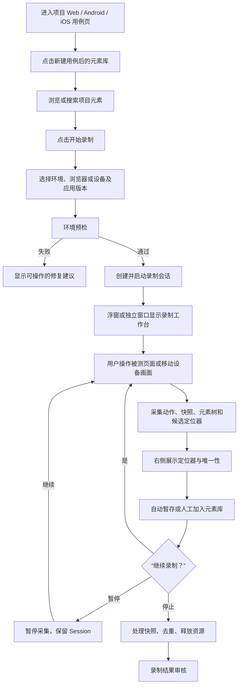
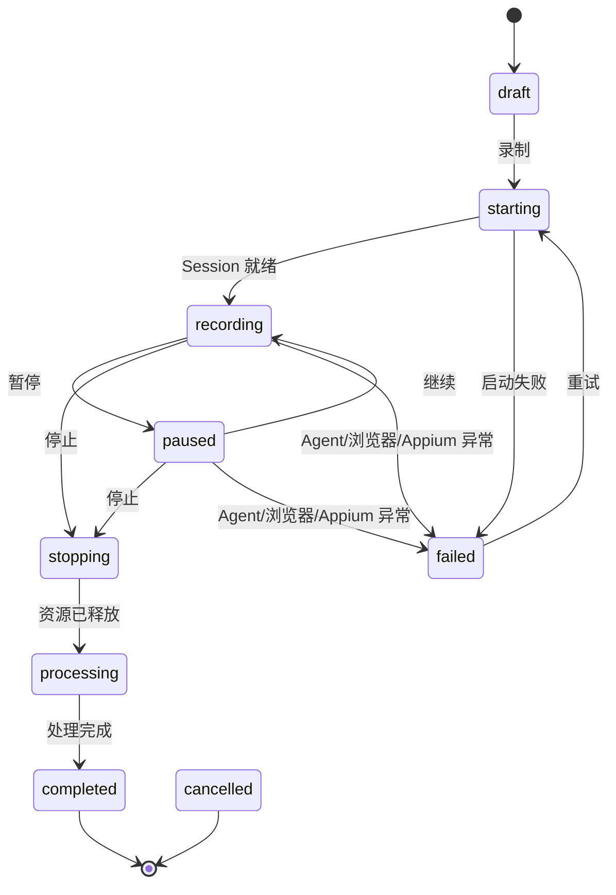
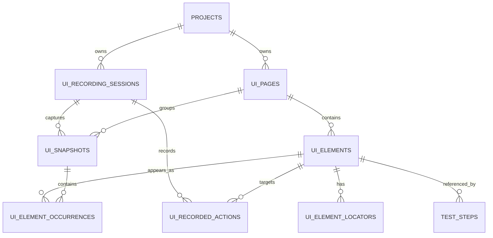
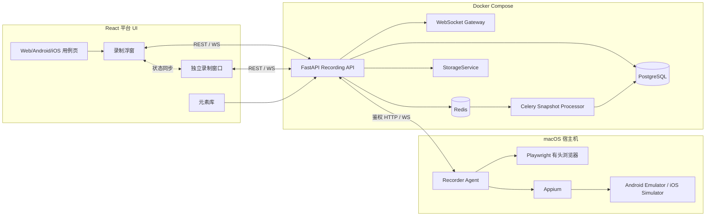

# 元素库与录制浮窗 MVP 需求与技术方案

> 文档版本：v0.1（评审稿）
> 编写日期：2026-08-06
> 适用项目：Automation Test Platform
> 目标平台：Web / Android / iOS
> 参考产品：[Jam](https://jam.dev/)
> 关联文档：[`UI录制中心-需求文档与实施方案.md`](./UI录制中心-需求文档与实施方案.md)、[`UI录制中心-决策记录-ADR.md`](./UI录制中心-决策记录-ADR.md)
> 专题目录索引：[`README.md`](./README.md)

## 1. 文档目的

本文档聚焦“元素库”的第一期可交付闭环，不重新定义完整 UI 录制中心。

本期解决四个明确需求：

1. 在项目的 Web、Android、iOS 用例页面中，将“元素库”入口放在“新建用例”按钮后面；
2. 元素录制工作台以可拖拽浮动窗口展示，并支持弹出为独立浏览器窗口；
3. 录制工作台提供录制、暂停/继续、停止按钮；
4. 用户点击被测页面元素后，在工作台右侧展示该元素当时可用的 CSS、XPath、ID 等候选定位器，并可保存到项目元素库。

本文档是现有《UI 录制中心需求文档与实施方案》的 MVP 专项细化。未在本文档中修改的页面、快照、元素、定位器、录制会话等定义，继续继承原文档及 ADR。

## 2. 产品定位

元素库不是一个人工填写定位器的表格，而是一个有页面快照、元素树和唯一性验证结果作为证据的“项目级元素事实库”。

参考 Jam 的核心思路是“在操作发生时捕获上下文”，但本平台捕获的重点不是缺陷视频，而是自动化执行需要的结构化事实：

- 操作发生在哪个项目、平台、环境和应用版本；
- 当时页面长什么样；
- 用户点击的是哪个真实元素；
- 该元素有哪些可执行定位器；
- 每个定位器是否唯一、稳定，何时验证过；
- 元素后来被哪些自动化用例引用。

## 3. 范围

### 3.1 MVP 包含

- Web / Android / iOS 用例页的元素库入口；
- 项目级元素库列表、搜索、详情和归档；
- 可拖拽、可缩放、非模态的录制浮窗；
- 浮窗弹出为独立浏览器窗口；
- 录制、暂停/继续、停止状态控制；
- Web 受控浏览器中的点击、输入、选择和页面跳转采集；
- Android/iOS 远程画面中的点击、输入和滑动采集；
- 页面截图、DOM/UI Hierarchy/Accessibility Tree 采集；
- 选中元素高亮和右侧候选定位器面板；
- 定位器唯一性验证、评分、复制和入库；
- 录制元素与现有 `TestStep` 的引用关系；
- 密码及敏感输入脱敏；
- 录制异常时浏览器/Appium Session 和设备租约的清理。

### 3.2 MVP 不包含

- 接管用户已经打开的普通 Chrome 标签页；
- 浏览器扩展分发；
- 自动遍历整个网站或 App；
- 纯视频录制与视频编辑；
- 仅凭截图或 AI 猜测定位器；
- 自动静默修改正式用例中的失效定位器；
- 多人同时控制同一个录制会话；
- 图形化节点连线 UI 地图；
- 完整替代 Playwright Inspector 或 Appium Inspector。

## 4. 核心原则

1. **录制不是新 Runner**：正式用例仍走现有 `TestCase → TestStep → StepDispatcher → Runner` 唯一执行链路。
2. **元素必须有证据**：正式元素至少关联一次页面快照、一次元素树节点和一次定位器验证结果。
3. **保存多个定位器**：一个元素不能只保存一个 XPath；需要保留主定位器和备用定位器。
4. **只输出当前 Runner 可执行的定位器**：候选策略必须和现有 Web/App Runner 支持的 `by` 值一致。
5. **录制与拾取分离**：录制模式不阻断用户真实操作；拾取模式只检查元素，不触发页面动作。
6. **服务端是状态事实源**：主页面浮窗、独立窗口和刷新后的页面都从同一服务端会话恢复状态。
7. **长会话不由普通 Celery 任务持有**：浏览器/Appium Session 必须由可寻址的 Recorder Agent 持有；Celery 仅处理快照解析、指纹、去重等离线任务。

## 5. 信息架构与入口

### 5.1 入口位置

现有项目详情页由 `ProjectDetailPage` 根据 Tab 加载 `AutomationCasesPage`。元素库入口直接加入 `AutomationCasesPage` 的工具栏。

展示规则：

| 当前 Tab | 是否显示 | 按钮位置 | 按钮文案 |
|---|---:|---|---|
| API | 否 | - | - |
| Web | 是 | “新建 Web 用例”后 | 元素库 |
| Android | 是 | “新建 Android 用例”后 | 元素库 |
| iOS | 是 | “新建 iOS 用例”后 | 元素库 |
| Functional | 否 | - | - |

工具栏顺序固定为：

```text
[新建 Web/Android/iOS 用例] [元素库] [后续已有操作……]
```

按钮禁用条件：

- 尚未选中模块时，“新建用例”维持现有禁用逻辑；
- “元素库”是项目级资产，不依赖模块，项目有效时始终可点击；
- 平台录制能力尚未通过预检时，允许浏览已有元素，但“开始录制”按钮不可用并显示具体原因。

### 5.2 元素库入口后的默认页面

点击“元素库”后打开项目级元素库抽屉，默认带入当前 Tab 的平台过滤条件。

抽屉包含：

- 顶部：平台、页面、状态、版本筛选和搜索框；
- 中部：元素列表，展示语义名称、所属页面、主定位器、稳定性、最近验证时间；
- 右侧/详情区：候选定位器、快照证据、属性、引用用例；
- 主操作：“开始录制”；
- 次操作：“打开完整元素库页面”。

点击“开始录制”后不关闭当前业务页面，而是打开录制浮窗。

## 6. 核心用户流程



## 7. 录制浮窗交互

### 7.1 浮窗性质

浮窗是非模态工作台，不使用普通 `Dialog`：

- 用户可以继续操作浮窗后面的项目页面；
- 通过标题栏拖动，不能从内容区误触发拖动；
- 支持四边/四角缩放；
- 默认尺寸建议为 `1080 × 680`，最小尺寸 `760 × 480`；
- 初始位置为视口居中偏右；
- 拖动和缩放后始终至少保留 48px 标题栏在视口内；
- 位置与尺寸按用户保存到 `localStorage`，键中包含项目和平台；
- `Esc` 只收起浮窗，不停止录制；
- 录制中点击关闭时，收起为迷你悬浮条，不直接销毁 Session；
- 停止录制需要显式点击“停止”。

### 7.2 浮窗布局

```text
┌────────────────────────────────────────────────────────────────────────────┐
│ 元素录制 · Web · 登录页       ● 录制中  00:03:21      [_] [弹出窗口] [×] │
├──────────────────────────────────────────────┬─────────────────────────────┤
│                                              │ 已选元素                    │
│   被测页面实时画面 / 最近快照                │ 登录按钮 <button>           │
│                                              │ ──────────────────────────  │
│   hover：元素边框高亮                        │ 推荐  ID       login-btn     │
│   click：选中并同步右侧                      │ 备用  CSS      #login-btn    │
│                                              │ 备用  XPath    //button...   │
│                                              │ 备用  Text     登录          │
│                                              │                             │
│                                              │ [验证] [复制] [加入元素库]  │
├──────────────────────────────────────────────┴─────────────────────────────┤
│ [● 录制] [Ⅱ 暂停/继续] [■ 停止] [⌖ 拾取元素]  已记录 12 个动作 / 8 个元素 │
└────────────────────────────────────────────────────────────────────────────┘
```

布局规则：

- 左侧约 65%：实时画面或最近一次快照；
- 右侧约 35%：选中元素详情和候选定位器；
- 底部固定：录制控制、拾取模式、统计和错误提示；
- 窗口宽度小于 900px 时，右侧面板改为可折叠抽屉；
- 元素变化通过 WebSocket 推送，不要求用户手动刷新。

### 7.3 独立浏览器窗口

浮窗标题栏提供“弹出窗口”按钮，通过 `window.open` 打开平台自己的录制工作台页面，而不是接管用户已有浏览器。

建议路由：

```text
/projects/:projectId/ui-elements/recorder/:sessionId?presentation=popout
```

独立窗口行为：

- 使用专用轻量布局，不显示平台侧栏和普通页头；
- 默认尺寸建议为 `1200 × 760`；
- URL 只包含会话 ID，不包含密码、Token、定位器或设备凭证；
- 身份认证沿用平台登录态；
- 独立窗口刷新后可通过会话 ID 恢复；
- 主页面关闭后，独立窗口仍可继续控制录制；
- 独立窗口关闭后，主页面浮窗可重新取得控制权；
- 浏览器阻止弹窗时，提示用户“浏览器已阻止独立窗口，请允许本站弹出窗口”，并保留当前浮窗；
- 主页面和独立窗口可以同时查看，但同一时刻只有一个“控制端”，避免重复发送录制命令。

同步设计：

- 录制状态、选中元素、时间线等权威状态通过后端 WebSocket 同步；
- `BroadcastChannel` 仅用于同源窗口间的快速控制权交接和关闭通知；
- 控制请求携带 `client_instance_id` 与幂等键；
- 服务端维护短租约 `control_owner`，非控制端的操作按钮只读；
- 控制端断开超过 5 秒后自动释放租约，另一个窗口可接管。

## 8. 录制控制与状态机

### 8.1 状态定义

| 状态 | 含义 | 允许操作 |
|---|---|---|
| `draft` | 已创建，尚未启动 | 录制、取消 |
| `starting` | 预检完成，正在创建浏览器/Appium Session | 取消 |
| `recording` | 正常采集动作、快照和元素 | 暂停、停止、拾取 |
| `paused` | 保留 Session，但不记录普通操作 | 继续、停止、拾取 |
| `stopping` | 已请求停止，正在收尾 | 无，仅查看进度 |
| `processing` | 快照解析、去重和元素合并中 | 无，仅查看进度 |
| `completed` | 收尾完成 | 查看结果、新建录制 |
| `failed` | 异常结束，保留已采集数据 | 查看错误、重试、新建录制 |
| `cancelled` | 启动前或录制中被取消 | 新建录制 |



### 8.2 三个主按钮

#### 录制

- `draft` 状态显示“录制”；
- 点击后先做环境预检，再创建 Session；
- `starting` 状态显示 loading，禁止重复点击；
- 从 `paused` 恢复时按钮文案为“继续”，恢复后立即采集一张基线快照。

#### 暂停/继续

- 暂停只停止动作和持久化快照采集，不关闭浏览器或 Appium Session；
- 暂停期间仍显示实时画面；
- Web 受控浏览器和移动端远程画面仍可操作，但这些操作不进入动作时间线；
- 拾取模式在暂停状态仍可使用，拾取结果可以加入元素库，但不生成录制动作；
- 继续时必须重新采集当前页面，避免页面已在暂停期间变化却错误连接前后动作。

#### 停止

- 停止前显示轻量确认：“停止后将关闭本次浏览器/设备会话，并处理已录制元素”；
- 确认后立即进入 `stopping`，按钮全部禁用；
- 正常或异常停止都必须执行 `finally` 清理；
- Web 关闭 Browser Context；
- Android/iOS 关闭 Appium Session 并释放设备；
- 已采集数据进入 `processing`，处理完成后展示录制审核结果。

### 8.3 拾取元素模式

拾取模式用于“只看定位器，不触发真实业务动作”：

- Web：鼠标经过时高亮，点击时阻止该次默认动作和事件冒泡，仅选中元素；
- Android/iOS：点击远程截图只做坐标命中与元素树选中，不向 Appium 转发 tap；
- 再次点击拾取按钮或按 `Esc` 退出拾取模式；
- 录制模式下的普通点击则不拦截，既执行真实动作，也记录目标元素。

## 9. 右侧元素与定位器面板

### 9.1 元素摘要

选中元素后展示：

- 语义名称，可编辑，如“登录按钮”；
- HTML tag / ARIA role / Android class / iOS type；
- 所属逻辑页面与页面状态；
- 页面 URL、Activity 或 bundleId；
- 元素文本、label、name、resource-id、content-desc 等安全属性；
- 屏幕/视口边界 `x, y, width, height`；
- 可见、可用、可点击状态；
- 当前快照和应用版本；
- 元素高亮预览。

### 9.2 候选定位器表

| 字段 | 说明 |
|---|---|
| 推荐 | 当前是否为主定位器 |
| 类型 | `id`、`css`、`xpath`、`accessibility_id` 等 |
| 定位值 | 实际传给 Runner 的 locator |
| 匹配数 | 在当前页面验证得到的匹配数量 |
| 唯一 | `match_count == 1` |
| 评分 | 0～100 |
| 风险 | 动态值、依赖文本、绝对 XPath、坐标等 |
| 最近验证 | 时间和对应快照 |
| 操作 | 复制、验证、设为推荐、查看证据 |

交互要求：

- 默认按评分降序排列；
- 只有当前 Runner 支持且验证通过的候选可以设为推荐；
- `match_count = 0` 标红，`> 1` 标黄，`= 1` 标绿；
- 点击候选时在左侧高亮其匹配结果；
- “复制”复制纯定位值，旁边提供“复制 by + locator JSON”；
- 用户可以修改元素语义名称和别名；
- 用户不能直接修改正式定位器字符串，定位器更新通过重新录制或单页面补录完成；
- “加入元素库”将当前暂存元素升级为项目正式元素；
- 录制期间发生过有效动作的目标元素默认暂存，停止后统一审核，避免误点击直接污染正式元素库。

## 10. 三端元素采集方案

### 10.1 Web

#### 浏览器接入

MVP 继续遵循 ADR-01：由平台通过 Playwright 启动独立受控浏览器，不接管用户已有 Chrome。

为满足有头浏览器和用户直接操作需求，Web Recorder 建议运行在 macOS 宿主机的 Recorder Agent 中。容器内 FastAPI 通过受鉴权的 HTTP/WebSocket 通道控制 Agent。

#### 事件采集

Recorder 在每个 Page/Frame 创建时注入监听器：

- 使用捕获阶段监听 `click`、`input`、`change`、`keydown`、`submit`；
- 普通录制不得调用 `preventDefault()` 或 `stopPropagation()`；
- 通过 `event.composedPath()` 识别 Shadow DOM 中的真实目标；
- 文本节点统一提升到最近的 `Element`；
- 组件库控件记录触发节点和最终可交互祖先节点；
- 监听 URL、frame、popup、dialog 和 DOM 稳定变化；
- 操作前后保存快照，并将动作关联到选中元素；
- 密码框、Token、验证码和配置的敏感选择器只保存脱敏占位符。

#### Web 定位器

当前 Web Runner 支持：

```text
css / xpath / id / name / class / text / link
```

MVP 生成优先级：

```text
稳定 id
→ data-testid/data-test 等测试属性（保存为 css）
→ name
→ 稳定属性组合 CSS
→ 稳定层级 CSS
→ link/text
→ 相对 XPath
→ 绝对 XPath（仅兜底，低分）
```

说明：ARIA `role + accessible name` 仍采集为元素属性和未来候选证据，但当前 `WebDriverAdapter.BY_TYPES` 不支持 `role`。在 Runner 正式增加 `by=role` 前，不得把它保存为可执行主定位器。

每个候选都必须在点击发生时的页面中验证匹配数。候选生成器不得只根据字符串规则推断“唯一”。

### 10.2 Android

Android 录制复用现有设备池和 Appium UiAutomator2：

- 录制开始时原子申请一台 `idle` Android 设备；
- 保存设备 UDID、平台版本、App 包、appPackage、appActivity 和窗口尺寸；
- 周期性获取截图和 `driver.page_source`；
- 用户点击左侧远程画面时，将画面坐标映射到设备原始坐标；
- 从 XML 中选择“包含点击点且面积最小的可交互节点”；
- 普通录制模式将 tap 转发给 Appium，拾取模式不转发；
- 操作后轮询结构 Hash，页面稳定后保存目标快照；
- 任何结束路径都释放设备租约。

MVP 推荐生成：

```text
accessibility_id/content-desc
→ id/resource-id
→ android_uiautomator
→ class_name + text 组合（必要时转 UiAutomator）
→ 相对 XPath
→ 绝对 XPath（低分）
```

生成结果必须落在现有 App Runner 支持的策略集合中：`id`、`xpath`、`accessibility_id`、`android_uiautomator`、`class_name` 等。

### 10.3 iOS

iOS 录制复用 Appium XCUITest，第一期先支持 Simulator：

- Recorder Agent 必须运行在 macOS + Xcode 节点；
- 获取截图和 XCUITest Accessibility Tree；
- 坐标命中逻辑与 Android 一致；
- 保存 bundleId、设备、系统版本、orientation 和窗口尺寸；
- 对系统权限弹窗、键盘和 WebView Context 单独标记；
- 真机的 WDA 签名与端口隔离不放入最小演示范围。

MVP 推荐生成：

```text
accessibility_id/name
→ ios_predicate
→ ios_class_chain
→ class_name + label/name
→ 相对 XPath
→ 绝对 XPath（低分）
```

### 10.4 WebView

- 原生上下文中的 WebView 容器可以作为普通 Native 元素采集；
- WebView 内部元素需要切换到 `WEBVIEW_*` Context 后按 Web 规则生成 CSS/XPath；
- 元素和快照必须记录 `context_type=native|webview`；
- 未开启调试能力时明确显示“WebView 内部元素不可采集”，不得退化成伪造定位器。

## 11. 定位器评分规则

评分用于排序和推荐，不替代真实验证。

建议基础分：

| 条件 | 分值变化 |
|---|---:|
| 当前页面唯一匹配 | +35 |
| 稳定 ID / resource-id / accessibility id | +30 |
| 项目约定测试属性，如 `data-testid` | +30 |
| 元素可见且可交互 | +10 |
| 两个及以上快照验证一致 | +10 |
| 依赖可变业务文本 | -10 |
| 包含长数字、UUID、时间戳特征 | -20 |
| 依赖 `nth-child` 或深层级 | -20 |
| 非唯一匹配 | -35 |
| 绝对 XPath | -40 |
| 纯坐标 | -60，且不得作为元素库主定位器 |

规则：

- 分数截断到 0～100；
- 推荐定位器必须唯一匹配且分数不低于 60；
- 没有满足条件的候选时，元素状态为 `unstable`，右侧明确提示“暂无可靠主定位器”；
- 评分权重放在服务层配置中，不写死在 Runner；
- AI 可以解释风险，但不能绕过唯一性验证提高分数。

## 12. 数据模型

本期复用并细化原 UI 录制中心的模型，不另建一套“element_library”重复表。



### 12.1 `ui_recording_sessions`

关键字段：

- `project_id`、`platform`、`environment_id`；
- `status`、`session_version`；
- `entry_config`：URL、浏览器、appPackage、bundleId 等；
- `device_id`、`agent_id`；
- `owner_user_id`、`control_owner`、`control_lease_expires_at`；
- `started_at`、`ended_at`、`error_code`、`error_message`；
- `stats`：动作、快照、暂存元素和正式元素数量。

### 12.2 `ui_pages`

项目内的逻辑页面：

- `project_id`、`platform`、`name`；
- `route_key`：Web URL 规范化结果、Android Activity 或 iOS 页面标识；
- `module_id` 可空；
- `status=current|stale|archived`；
- `aliases`、`metadata`。

建议唯一约束：`(project_id, platform, route_key, status=current)` 由服务层保证，避免同一个逻辑页面无限重复创建。

### 12.3 `ui_snapshots`

保存截图、原始树、规范化树和页面指纹。大文件通过统一 `StorageService` 保存，数据库只保存路径和摘要。

### 12.4 `ui_elements`

逻辑元素，绑定 `ui_pages`：

- `canonical_name`、`aliases`；
- `element_type`、`fingerprint`；
- `status=captured|active|unstable|stale|archived`；
- `first_seen_version`、`last_seen_version`；
- `created_by`、`updated_by`、时间戳。

其中 `captured` 表示录制中暂存、尚未审核加入正式元素库。

### 12.5 `ui_element_occurrences`

记录元素在某个快照中的真实出现：

- `element_id`、`snapshot_id`；
- `tree_path`、`bounds`；
- `attributes`、`visible`、`enabled`、`clickable`；
- `context_type`、`frame_path`；
- `captured_at`。

### 12.6 `ui_element_locators`

- `element_id`、`platform`；
- `by`、`locator`；
- `score`、`match_count`、`unique_match`；
- `is_primary`；
- `source=rule|recording|migration|ai_suggestion`；
- `evidence_snapshot_id`；
- `validated_at`、`status=active|failed|stale`；
- `risk_flags`。

数据库约束建议：

- 唯一索引：`(element_id, by, locator)`；
- 一个元素最多一个 `is_primary=true AND status=active`；
- `match_count >= 0`；
- `score` 在 0～100；
- `is_primary=true` 时必须有 `evidence_snapshot_id`。

### 12.7 `ui_recorded_actions`

保存动作前后快照、目标元素、脱敏后的原始事件和可映射的 `TestStep` 草稿。

### 12.8 `test_steps` 元素引用

现有 `test_steps` 没有元素引用字段。为了让元素库能回答“被哪些用例使用”并支持后续失效分析，建议新增：

- `element_id bigint nullable`，外键指向 `ui_elements.id`，删除元素时 `SET NULL`；
- `locator_id bigint nullable`，外键指向录制时选择的 `ui_element_locators.id`，删除时 `SET NULL`。

执行时仍只读取 `TestStep.config.by` 和 `TestStep.config.locator`；`element_id/locator_id` 只用于追溯，不改变 Runner 协议。

## 13. API 设计

所有接口沿用 `{status: "success"|"error", data?, message?}` 信封，并执行项目对象级授权。

### 13.1 录制会话

```http
POST   /api/ui-recordings
GET    /api/ui-recordings?project_id=&platform=&status=
GET    /api/ui-recordings/{id}
POST   /api/ui-recordings/{id}/preflight
POST   /api/ui-recordings/{id}/start
POST   /api/ui-recordings/{id}/pause
POST   /api/ui-recordings/{id}/resume
POST   /api/ui-recordings/{id}/stop
POST   /api/ui-recordings/{id}/cancel
POST   /api/ui-recordings/{id}/claim-control
DELETE /api/ui-recordings/{id}
```

所有控制接口必须：

- 校验服务端当前状态；
- 校验 `control_owner`；
- 支持幂等键；
- 返回更新后的 `session_version`；
- 不直接持有 Playwright/Appium 对象，只转发给对应 Agent。

### 13.2 实时通道

```http
WS /api/ui-recordings/{id}/stream
```

服务端消息：

```text
session_status
screen_frame
snapshot_created
action_created
element_hovered
element_selected
locator_validation_updated
processing_progress
control_owner_changed
error
```

客户端消息：

```text
heartbeat
set_pick_mode
select_coordinate
perform_action
validate_locator
claim_control
```

### 13.3 页面与元素库

```http
GET    /api/ui-pages?project_id=&platform=&keyword=
GET    /api/ui-pages/{id}
GET    /api/ui-pages/{id}/elements
GET    /api/ui-elements?project_id=&platform=&page_id=&status=&keyword=
GET    /api/ui-elements/{id}
PATCH  /api/ui-elements/{id}                    # 只改语义名称、别名、状态
POST   /api/ui-elements/{id}/activate            # 暂存元素加入正式库
POST   /api/ui-elements/{id}/archive
POST   /api/ui-elements/{id}/validate-locators
GET    /api/ui-elements/{id}/references
GET    /api/ui-snapshots/{id}/screenshot
GET    /api/ui-snapshots/{id}/tree
```

MVP 不提供让前端任意改写正式 locator 字符串的通用接口。定位器必须由带证据的录制、补录、迁移或后续审核流程生成。

### 13.4 关键事件示例

```json
{
  "type": "element_selected",
  "session_id": 42,
  "session_version": 18,
  "data": {
    "element_id": 901,
    "occurrence_id": 1307,
    "snapshot_id": 806,
    "name": "登录按钮",
    "element_type": "button",
    "bounds": {"x": 812, "y": 536, "width": 120, "height": 40},
    "attributes": {
      "id": "login-btn",
      "data-testid": "login-submit",
      "text": "登录"
    },
    "locators": [
      {
        "by": "id",
        "locator": "login-btn",
        "score": 95,
        "match_count": 1,
        "unique_match": true,
        "is_primary": true
      },
      {
        "by": "css",
        "locator": "[data-testid='login-submit']",
        "score": 93,
        "match_count": 1,
        "unique_match": true,
        "is_primary": false
      },
      {
        "by": "xpath",
        "locator": "//button[@id='login-btn']",
        "score": 72,
        "match_count": 1,
        "unique_match": true,
        "is_primary": false
      }
    ]
  }
}
```

## 14. 技术架构



### 14.1 Recorder Agent

本专项方案建议将原 ADR-11/ADR-12 的推荐方案定版为：

- Web 和移动录制均由宿主机 Recorder Agent 持有长生命周期 Session；
- Agent 提供健康检查、预检、启动、暂停、拾取、动作、截图和停止接口；
- FastAPI 按 `agent_id` 寻址，不依赖 Celery 定向到特定进程；
- Agent 与 API 使用短期签名 Token，禁止匿名控制；
- Agent 崩溃后 API 将会话标记 `failed`，已落库快照保留；
- 启动代码开发前，需要先把 ADR-11 和 ADR-12 从“待定”更新为“已定版”。

### 14.2 Celery 职责

Celery 只处理可重试、无 Session 状态的任务：

- DOM/XML 规范化；
- 截图脱敏；
- 页面和元素指纹；
- 候选定位器评分；
- 快照去重与页面归类；
- 停止后的批量收尾；
- 后续版本对比。

### 14.3 建议模块边界

```text
server/api/ui_recordings.py
server/api/ui_pages.py
server/api/ui_elements.py
server/services/ui_recording_service.py
server/services/ui_element_service.py
server/services/ui_locator_service.py
server/services/ui_snapshot_service.py
server/services/recorder_agent_client.py
database/models/ui_recording_session.py
database/models/ui_page.py
database/models/ui_snapshot.py
database/models/ui_element.py
database/models/ui_element_occurrence.py
database/models/ui_element_locator.py
database/models/ui_recorded_action.py
database/schemas/ui_recording.py
database/schemas/ui_element.py
tasks/ui_snapshot_task.py
tasks/ui_recording_finalize_task.py
recorder_agent/
frontend/src/pages/ui-elements/
frontend/src/components/ui-recorder/
```

录制器协议继续返回纯字典，不依赖 ORM；持久化只在服务层完成。

## 15. 前端组件设计

```text
frontend/src/pages/ui-elements/
├── ElementLibraryPage.tsx
├── ElementLibraryDrawer.tsx
├── ElementList.tsx
├── ElementDetail.tsx
└── RecorderPopoutPage.tsx

frontend/src/components/ui-recorder/
├── RecorderLauncher.tsx
├── RecorderFloatingWindow.tsx
├── RecorderTitleBar.tsx
├── RecorderViewport.tsx
├── RecorderControls.tsx
├── RecorderStatusBadge.tsx
├── ElementInspectorPanel.tsx
├── LocatorCandidateTable.tsx
├── RecordingPreflight.tsx
└── useRecorderSession.ts
```

关键约束：

- `useRecorderSession(sessionId)` 是浮窗和独立窗口共用的唯一状态 Hook；
- 服务端状态使用 TanStack Query 缓存，实时事件通过 WebSocket 合并；
- 连接断开时顶部显示“正在重连”，不把会话擅自改为失败；
- 多窗口对同一 Query 数据的同步不能只依赖内存；
- 拖动使用 Pointer Events，并区分点击与拖动阈值；
- 浮窗通过 React Portal 挂到 App 根节点，避免受父级 `overflow` 和 stacking context 影响；
- 浮窗位置不上传服务端，录制业务状态必须上传服务端；
- 独立窗口使用专用路由和布局，不复制一套录制逻辑。

## 16. 安全与隐私

- `input[type=password]` 的值永不进入前端事件、WebSocket、日志和数据库；
- Token、验证码、身份证号等根据项目脱敏规则替换为占位符；
- 截图脱敏在落盘前完成，失败时不保存原始敏感截图；
- DOM/XML 中的输入值、Cookie、Authorization、localStorage 不属于元素采集范围；
- 不读取或保存用户普通浏览器的历史、Cookie 和密码；
- Recorder Agent 只接受平台签发的短期控制 Token；
- 所有会话、页面、元素和快照接口执行项目对象级授权；
- 元素归档、定位器主候选切换、快照删除记录审计；
- 删除项目时明确级联/归档范围，不能留下失去归属的截图文件。

## 17. 异常处理

| 场景 | 产品表现 | 后端动作 |
|---|---|---|
| 浏览器内核未安装 | 预检失败并给安装命令 | 不创建活跃 Session |
| 初始 URL 不可访问 | 展示 DNS/连接/HTTP 原因 | 会话保留 `draft` |
| Appium 不健康 | 显示地址和 Driver 检查建议 | 不占用设备 |
| 设备离线 | 禁用录制并刷新设备列表 | 不创建租约 |
| 录制中 Agent 断开 | 浮窗显示重连倒计时 | 超时标记 `failed`，释放租约 |
| 页面关闭/崩溃 | 提示页面已关闭 | 尝试保存最后快照并失败收尾 |
| WebSocket 断开 | 状态条显示重连 | 会话继续，恢复后按版本补事件 |
| 定位器验证超时 | 候选标记“未验证” | 不设为主定位器 |
| 弹窗被浏览器阻止 | 保留浮窗并提示允许弹窗 | 不改变会话 |
| 主页面刷新 | 重建浮窗并恢复会话 | 从服务端读取状态 |
| 用户直接关闭浮窗 | 收起为迷你控制条 | 不停止录制 |
| 用户关闭独立窗口 | 主窗口可重新接管 | 释放控制租约 |

## 18. 验收标准

### 18.1 通用

1. Web、Android、iOS 页面的“元素库”按钮准确位于“新建用例”之后；
2. API 和功能用例页面不显示该按钮；
3. 元素库可以按当前项目、平台、页面、名称和定位器搜索；
4. 浮窗可拖动、缩放、收起，并且不会被常规页面内容遮挡；
5. 浮窗不能被拖到完全不可见区域；
6. 可以将录制工作台弹出为独立浏览器窗口；
7. 独立窗口刷新或主页面关闭后，录制状态仍可恢复；
8. 录制、暂停/继续、停止按钮严格遵循状态机，不允许重复提交；
9. 停止或异常结束后浏览器/Appium Session 和设备租约均被释放；
10. 密码和敏感输入没有明文落库或出现在日志中。

### 18.2 Web

1. 平台可以启动有头 Chromium 并打开指定 URL；
2. 用户普通点击不被录制脚本阻断；
3. 点击元素后 500ms 内右侧出现元素摘要和候选定位器；
4. 对带稳定 ID 的元素至少显示 `id`、`css` 和 `xpath` 三类候选；
5. 每个候选显示真实匹配数和唯一性；
6. 主定位器必须能被现有 Web Runner 执行；
7. Shadow DOM、iframe 或组件库控件无法准确识别时明确标记风险；
8. 拾取模式点击不会触发页面原动作。

### 18.3 Android

1. 可选择并锁定一台空闲 Android 设备；
2. 远程画面点击能命中对应 XML 节点；
3. 至少生成 resource-id/accessibility id/XPath 中实际存在的候选；
4. 普通录制点击会转发 Appium，拾取模式不转发；
5. Session 结束后设备恢复 `idle`。

### 18.4 iOS

1. 可连接一个 iOS Simulator；
2. 远程画面点击能命中 Accessibility Tree 节点；
3. 至少生成 accessibility id/Predicate/Class Chain/XPath 中实际存在的候选；
4. 生成定位器可由现有 App Runner 验证；
5. Session 结束后 WDA/Appium 资源清理完成。

## 19. 测试方案

### 19.1 单元测试

- Web CSS/XPath/ID 候选生成；
- Android/iOS 候选生成；
- 特殊字符转义；
- 动态 ID 风险识别；
- 唯一性和评分计算；
- DOM/XML 规范化与元素指纹；
- 坐标到元素树节点的命中；
- 状态机非法转换；
- 敏感输入脱敏；
- 控制租约与幂等请求。

### 19.2 集成测试

- 主页面浮窗与独立窗口状态同步；
- Playwright 登录流程录制；
- antd/Element Plus/MUI 典型控件点击采集；
- iframe、Shadow DOM、popup 和页面跳转；
- Android 模拟器点击/输入/滑动；
- iOS Simulator 点击/输入；
- 录制停止、浏览器崩溃、Agent 重启、Appium 断连；
- 元素入库后在步骤编辑器中选择并回放。

### 19.3 前端交互测试

- 1920×1080、1440×900、1366×768 三种尺寸下拖动与缩放；
- 浮窗越界回弹；
- 窗口小于 900px 时详情面板折叠；
- 弹窗被拦截；
- 主页面和独立窗口抢占控制权；
- `Esc` 收起但不停止；
- 断网后重连与状态补偿。

## 20. 分阶段实施建议

### 阶段 0：契约与 Spike，3～5 个工作日

- 将 ADR-11/ADR-12 的 Recorder Agent 推荐方案正式定版；
- 冻结会话状态机、Agent 协议和 WebSocket 消息格式；
- 验证 Playwright 有头浏览器事件注入；
- 验证 iframe、Shadow DOM 和一个项目实际使用的组件库；
- 验证 Android/iOS Page Source 性能和坐标命中；
- 输出数据库迁移评审稿；
- 验证浮窗与独立窗口的状态同步原型。

### 阶段 1：元素库壳与 Web 闭环，2～3 周

- 三端页面入口和项目级元素库；
- 浮窗、独立窗口和控制租约；
- Recorder Agent 基础服务；
- Web 有头浏览器录制；
- DOM/截图/动作/定位器采集；
- 元素暂存、审核和入库；
- Web Runner 回放验证。

### 阶段 2：Android，3～4 周

- 设备租约补强；
- Android 远程画面与 UiAutomator2 Page Source；
- 坐标命中、动作转发和定位器生成；
- Android Runner 回放；
- WebView Context 支持。

### 阶段 3：iOS，2～3 周

- iOS Simulator、XCUITest 和 WDA；
- Accessibility Tree、坐标命中和候选定位器；
- iOS Runner 回放；
- WKWebView 支持。

### 阶段 4：元素消费与维护增强，2 周

- 步骤编辑器“从元素库选择”；
- 元素引用用例查询；
- 页面/元素版本对比；
- 定位器失效建议；
- 元素稳定性和复用率看板。

## 21. 预计修改范围（仅规划，本文档阶段不改代码）

### Frontend

- `frontend/src/pages/AutomationCasesPage.tsx`：在 Web/Android/iOS 新建用例后增加入口；
- `frontend/src/routes.tsx`：元素库完整页和独立录制窗口路由；
- `frontend/src/lib/api.ts`：录制会话、页面、元素接口；
- `frontend/src/types/domain.ts`：录制与元素领域类型；
- `frontend/src/pages/ui-elements/`：元素库页面与独立窗口；
- `frontend/src/components/ui-recorder/`：浮窗、控制栏、画面与定位器面板；
- `frontend/src/components/case/step-editor.tsx`：后续从元素库选元素。

### Backend

- `database/models/`：会话、页面、快照、元素、出现记录、定位器、动作模型；
- `database/schemas/`：请求响应契约；
- `database/migrations/versions/`：PostgreSQL 迁移及索引；
- `server/api/`：录制、页面和元素 API；
- `server/services/`：录制编排、Agent 客户端、快照、元素和定位器服务；
- `tasks/`：快照解析和录制收尾；
- `server/main.py`、`server/api/__init__.py`、`celery_app.py`：注册新增模块；
- `recorder_agent/`：宿主机 Recorder Agent；
- `runners/web/adapters.py`：只有在后续正式支持 `by=role` 时才扩展；
- `database/models/test_step.py`：增加可选元素追溯字段，但不改变执行字典。

## 22. 开发前需要确认的产品决策

以下建议已写入本文档，但在开始编码前应由产品/技术负责人确认：

1. “元素库”是项目级资产，因此不选择模块也能打开；
2. Web 录制只支持平台启动的受控浏览器；
3. “打开第二个浏览器页面”指弹出平台录制工作台，不是接管用户已有网页；
4. 浮窗关闭只收起，停止录制必须显式点击“停止”；
5. 普通录制和只选不点的“拾取模式”同时保留；
6. 录制目标元素先暂存，停止后审核加入正式元素库；
7. 正式定位器不能在元素库里随意手改，只能通过重录/补录更新；
8. 第一阶段先交付 Web 完整闭环，再交付 Android 和 iOS；
9. Recorder Agent 采用宿主机原生进程，长会话不由 Celery Worker 持有；
10. `test_steps` 增加元素和定位器引用字段，用于追溯，但 Runner 仍只消费 `config`。

## 23. 结论

本期推荐的最小可用闭环是：

```text
三端用例页入口
→ 项目元素库
→ 可拖拽/可弹出的录制工作台
→ 录制/暂停/停止
→ 点击真实元素
→ 右侧展示经过唯一性验证的多个定位器
→ 暂存并审核入库
→ Web 现有 Runner 回放验证
```

先把 Web 做成一条真实可回放的闭环，再复用同一会话、页面、元素和定位器模型扩展 Android/iOS，可以避免三端同时铺开但没有任何一端真正可用。
